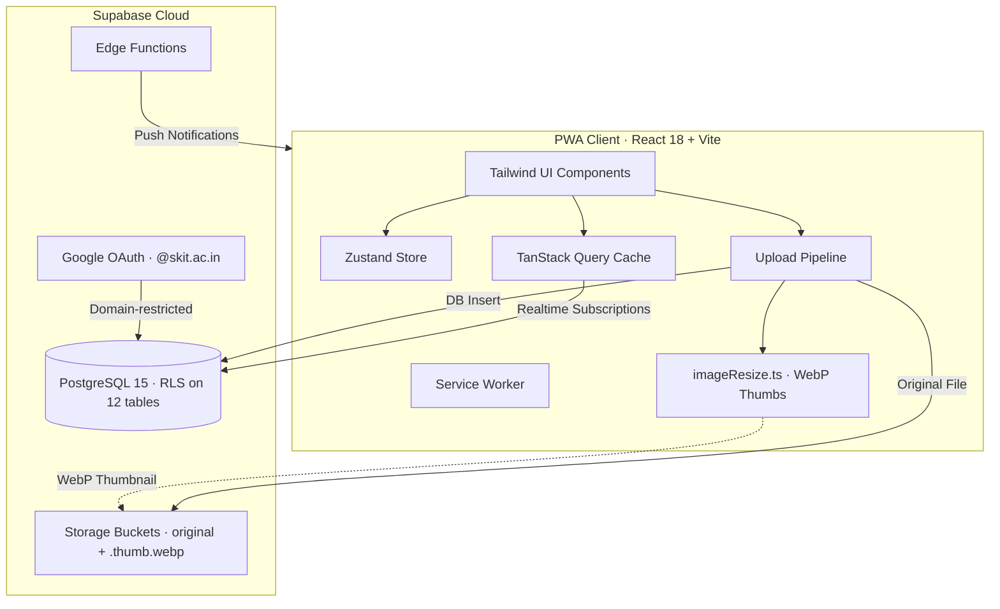

<div align="center">

# 🎓 ClassHub

**Your Academic Workspace**

[](LICENSE)
[](https://classshub.vercel.app)
[](https://www.typescriptlang.org/)
[](https://supabase.com)
[](https://react.dev)
[](https://web.dev/progressive-web-apps/)
[](https://ko-fi.com/himanshuhanu)

</div>

---

ClassHub is a progressive web app that replaces scattered WhatsApp groups and Google Forms with a single, secure academic workspace. Built for Indian engineering college sections, it gives Class Representatives a command center and students a unified dashboard for everything academic.

---

## 📸 Screenshots

<div align="center">

<!-- Add your screenshots to docs/screenshots/ and uncomment the lines below -->

<!--  -->
<!--  -->
<!--  -->

*Screenshots coming soon — add images to `docs/screenshots/`*

</div>

---

## ✨ Features

### 📊 Dashboard
- **Today's Schedule** — live class timetable with room numbers and status tags &nbsp; 👤
- **Quick Stats** — pending assignments, submissions, and alerts at a glance &nbsp; 👤
- **Attendance Overview** — subject-wise attendance rings with weekly tracking &nbsp; 👤
- **Campus Poll** — live poll results embedded right on the dashboard &nbsp; 👤

### 📢 Announcements
- **Channel Scoping** — filter by Active Feed, Exams, Schedule, and Campus &nbsp; 👤
- **Priority & Deadlines** — urgent deadline highlights and critical alerts &nbsp; 👤 👑
- **Acknowledgment Tracking** — track who's read each announcement with nudge support &nbsp; 👑
- **Broadcast** — push announcements to the entire section instantly &nbsp; 👑

### 📝 Assignments
- **Assignment Sets** — group assignment instructions under specific subjects &nbsp; 👑
- **Roll-Based Distribution** — auto-assign question sets based on roll number &nbsp; 👤
- **Digital Submissions** — file uploads (docs, PDFs, code, images) with Drive links &nbsp; 👤
- **Submission Health Monitor** — track submitted vs pending across all assignments &nbsp; 👑

### 📊 Polls
- **Anonymous Voting** — cryptographic hash validation prevents duplicate votes &nbsp; 👤
- **CR-Visible Polls** — optional transparency mode where CR can see individual responses &nbsp; 👑
- **Live Analytics** — real-time visual summaries of class preferences &nbsp; 👤 👑

### 👑 CR Command Center
- **Section Pulse** — student count, active tasks, and live polls overview &nbsp; 👑
- **Quick Actions** — create announcements, assignments, polls, and timetables &nbsp; 👑
- **Acknowledgment Progress** — visual progress bars with nudge-unacknowledged action &nbsp; 👑
- **Submissions Hub** — centralized evaluation view across all assignments &nbsp; 👑

### 🖼️ Media Optimization
- **Dual-Tier WebP Delivery** — upload-time thumbnail generation reduces images up to 99.5% in size
- **Hardware-Accelerated Fallback** — `createImageBitmap` canvas downscaling for legacy images
- **Progressive Zoom Modal** — cached thumbnail → high-res crossfade with full zoom/pan

### 📈 GPA Calculator & Analytics
- **Target Tracking** — interactive GPA calculation with semester goal visualization &nbsp; 👤
- **Relative Grading** — grade distribution analysis tools &nbsp; 👤

> 👤 = Student &nbsp;&nbsp; 👑 = Class Representative (CR)

---

## 🛠️ Tech Stack

| Layer | Technologies |
|---|---|
| **Frontend** | React 18, Vite, TypeScript (Strict), React Router v6 |
| **Styling** | Tailwind CSS v3 — dark-mode glassmorphic design system |
| **State** | Zustand (client state), TanStack Query v5 (server state) |
| **Backend** | Supabase JS v2 — Realtime, Auth, Edge Functions |
| **Database** | PostgreSQL 15 with Row-Level Security on all 12 tables |
| **Auth** | Google OAuth restricted to `@skit.ac.in` domain |
| **PWA** | Vite PWA Plugin with Service Worker caching & precaching |
| **Deploy** | Vercel (frontend), Supabase Cloud (backend) |

---

## 🏗️ Architecture



> For the full architecture breakdown, see [docs/architecture.md](docs/architecture.md).

---

## 🔗 Live Demo

> 🔐 **Live at [classshub.vercel.app](https://classshub.vercel.app)** — requires an `@skit.ac.in` Google Workspace account.
>
> See screenshots above for a full preview of the app experience.

---

## 🚀 Local Development

### Prerequisites
- Node.js v18+
- npm v9+

### Setup

```bash
# Clone the repository
git clone https://github.com/Hanu2908/ClassHub.git
cd ClassHub

# Install dependencies
npm install

# Create environment file
cp .env.example .env
# Edit .env with your Supabase project URL and anon key

# Start development server
npm run dev
```

### Available Commands

```bash
npm run dev      # Start Vite HMR dev server
npm run build    # TypeScript compile + production build
npm run lint     # ESLint check
npm test         # Run Vitest unit tests
```

> See [docs/schema.sql](docs/schema.sql) for the database schema, [docs/decisions.md](docs/decisions.md) for architectural decisions, and [docs/architecture.md](docs/architecture.md) for the full system design.

---

## 🔒 Security

ClassHub enforces strict data isolation across every layer:

- **Row-Level Security (RLS)** — enforced on all 12 tables; every query filters by `section_id` from the authenticated user's session
- **Domain Authorization** — Google OAuth restricted to `@skit.ac.in` institutional emails only
- **No Third-Party Credentials** — student ERP logins and private credentials are **never** requested, scraped, or stored
- **Vote Integrity** — cryptographic hash validation on polls prevents duplicate and tampered votes

> See [docs/rls-test-plan.md](docs/rls-test-plan.md) and [docs/security-remediation.md](docs/security-remediation.md) for security testing details.

---

## 🤝 Contributing

ClassHub is under active development by a small team at SKIT Jaipur. We're not accepting external contributions at this time, but feel free to [open an issue](https://github.com/Hanu2908/ClassHub/issues) for feature suggestions or bug reports.

---

## 📄 License

This project is licensed under the [MIT License](LICENSE).

---

## ☕ Support

If ClassHub is useful to you, consider buying us a coffee!

<a href="https://ko-fi.com/himanshuhanu" target="_blank">
  
</a>

---

<div align="center">

**Built by [Himanshu Saini](https://github.com/Hanu2908)** · SKIT Jaipur

</div>
