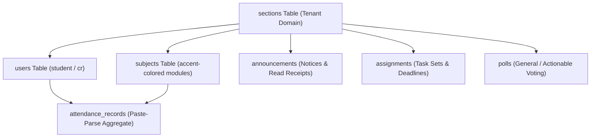

# ClassHub — Product Design & Visual Identity Spec

This document details the visual style system, architectural shape, critical files, and core product objectives of **ClassHub** (V1.0 Closed Beta, Section P2, SKIT Jaipur).

---

## 1. Core Identity & Visual Purpose

**ClassHub** is a highly optimized, mobile-first, multi-tenant academic management Progressive Web Application (PWA). It provides a secure, zero-overhead administrative and workspace command hub for academic sections, replacing loose messaging groups and manual trackers with structured student feeds.

* **Product Tagline**: The Multi-Tenant Academic Command Hub
* **College Scoping**: Exclusive to Swami Keshvanand Institute of Technology (SKIT) Jaipur.
* **Access Restraints**: Restricted via Google OAuth to authenticated users with `@skit.ac.in` domain emails only.
* **Theme Aesthetic**: Premium, low-fatigue **cyberpunk glassmorphism** with deep, ultra-dark backgrounds, vibrant neon accents, high-contrast typography, and smooth micro-interactions.

---

## 2. Design Token System (Source of Truth)

All styling within ClassHub is driven by the global tokens declared in [src/index.css](file:///e:/HIMANSHU/1ST_YEAR_Project/ClassHub-1/src/index.css). Ad-hoc styling is strictly discouraged.

### Color Palettes & Contrast (WCAG AA Compliant)

| Token | CSS Variable | Hex / RGBA Value | Purpose |
| :--- | :--- | :--- | :--- |
| **Base Background** | `--bg-base` | `#0A0C14` | Body canvas |
| **Glass Surface** | `--bg-surface` | `rgba(20, 24, 38, 0.45)` | Standard card backgrounds |
| **Glass Elevated** | `--bg-elevated` | `rgba(28, 34, 54, 0.65)` | Overlays & modals |
| **Accent Primary** | `--accent-primary` | `#60A5FA` | Active items, highlights (7.6:1 contrast) |
| **Status Critical** | `--status-critical` | `#F87171` | Warning alerts, absent states, critical news |
| **Status Warning** | `--status-warning` | `#FBBF24` | Danger states, pending deadlines |
| **Status Safe** | `--status-safe` | `#34D399` | Present attendance, completed tasks |
| **Status Info** | `--status-info` | `#22D3EE` | General badges & indicators |
| **Primary Text** | `--text-primary` | `#F0F2F8` | Headers & primary reading |
| **Secondary Text** | `--text-secondary` | `#8B93A8` | Subtext, labels, and icons |
| **Muted Text** | `--text-muted` | `#4A5268` | Disabled states and placeholder labels |
| **Default Border** | `--border-default` | `rgba(255, 255, 255, 0.08)`| Standard dividers & structural borders |

### Glassmorphism & Depth
To prevent rendering and minification bugs, backdrop filters use direct static values:
* **Standard Glass**: `backdrop-filter: blur(24px) saturate(180%)`
* **Heavy Glass**: `backdrop-filter: blur(32px) saturate(200%)`
* **Bottom Navigation**: `.navbar` uses `background: rgba(10, 12, 20, 0.70)` with a hardware-accelerated static `-webkit-backdrop-filter: blur(24px) saturate(180%)` and safe-area dynamic heights.

### Typography Stack
Fonts are pulled directly from Google Fonts:
* **Headers & Display**: `'Space Grotesk'`, sans-serif — used for bold titles and section headings.
* **Reading & Content**: `'DM Sans'`, sans-serif — used for body copies, inputs, and paragraphs.
* **Numbers & Systems**: `'JetBrains Mono'`, monospace — used for roll numbers, stats, and deadlines.

---

## 3. Product's Native Shape (Database Architecture)

ClassHub is fundamentally designed around the concept of a **multi-tenant section workspace**. Everything is strictly isolated by `section_id` in row-level security (RLS) policies.

---

## 4. Critical Codebase Files

The functionality of ClassHub is anchored in these key modules:

### Frontend Layer
1. **[src/index.css](file:///e:/HIMANSHU/1ST_YEAR_Project/ClassHub-1/src/index.css)**: Holds all design token variables, resets, and core animation keyframes.
2. **[src/components/AuthProvider.tsx](file:///e:/HIMANSHU/1ST_YEAR_Project/ClassHub-1/src/components/AuthProvider.tsx)**: Manages Google OAuth, user profiles, session states, and hosts the active **Supabase Realtime** workspace subscribers.
3. **[src/components/NavBar.tsx](file:///e:/HIMANSHU/1ST_YEAR_Project/ClassHub-1/src/components/NavBar.tsx)**: Dynamic bottom navigation bar that shifts layout depending on whether the user role is `student` or `cr`.
4. **[src/pages/app/DashboardPage.tsx](file:///e:/HIMANSHU/1ST_YEAR_Project/ClassHub-1/src/pages/app/DashboardPage.tsx)**: Main feed integrating real-time announcements, attendance quick-gauges, current schedule modules, and active polls.
5. **[src/pages/app/AttendancePage.tsx](file:///e:/HIMANSHU/1ST_YEAR_Project/ClassHub-1/src/pages/app/AttendancePage.tsx)**: Integrates the zero-credentials TSV/space paste ERP attendance parser.
6. **[src/pages/app/PollsPage.tsx](file:///e:/HIMANSHU/1ST_YEAR_Project/ClassHub-1/src/pages/app/PollsPage.tsx)**: The interactive general and actionable voting dashboard.
7. **[src/pages/app/CRCommandPage.tsx](file:///e:/HIMANSHU/1ST_YEAR_Project/ClassHub-1/src/pages/app/CRCommandPage.tsx)**: Unified command dashboard for class representatives to create polls, route assignments, track submissions, and broadcast critical announcements.

### Database Layer (`supabase/migrations/`)
1. **[202605150001_initial_schema.sql](file:///e:/HIMANSHU/1ST_YEAR_Project/ClassHub-1/supabase/migrations/202605150001_initial_schema.sql)**: Contains the base tables, constraints, functions, and initial schema definitions.
2. **[202605150002_rls_policies.sql](file:///e:/HIMANSHU/1ST_YEAR_Project/ClassHub-1/supabase/migrations/202605150002_rls_policies.sql)**: Holds the strict security boundaries that prevent cross-section read/write leaks.
3. **[202605200001_poll_multi_select.sql](file:///e:/HIMANSHU/1ST_YEAR_Project/ClassHub-1/supabase/migrations/202605200001_poll_multi_select.sql)**: Idempotent SQL trigger and key structure enabling multi-select and vote revocation.

---

## 5. Core Objectives & Scope Boundaries

### Active Goals
* **RLS Integrity**: Absolutely no queries may trust the client to restrict data; they must always validate against `auth.uid()` and scope to the user's `section_id`.
* **Zero-Credential Scraped Free**: Attendance is managed strictly by parsing raw copy-pasted ERP dashboard text. Student passwords or portal logins must never be stored.
* **Instant Collaboration**: Utilize database subscriptions so CR additions reflect immediately on student viewports in real-time.

### Banned Features (Strictly Out of Scope)
* **Resource Vault**: No direct file lockers or class resource sharing.
* **Syllabus Tracker**: Banned.
* **Anonymous Feedback**: Banned.
* **Lost & Found**: Banned.
* **Community Uploads**: Students are blocked from uploading arbitrary public files.
* **ERP Scraping**: No automated server-side login actions.
