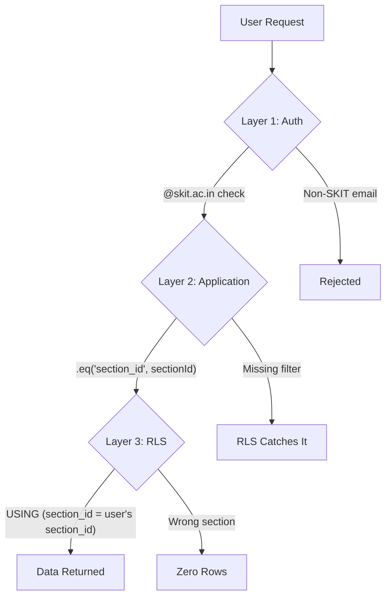
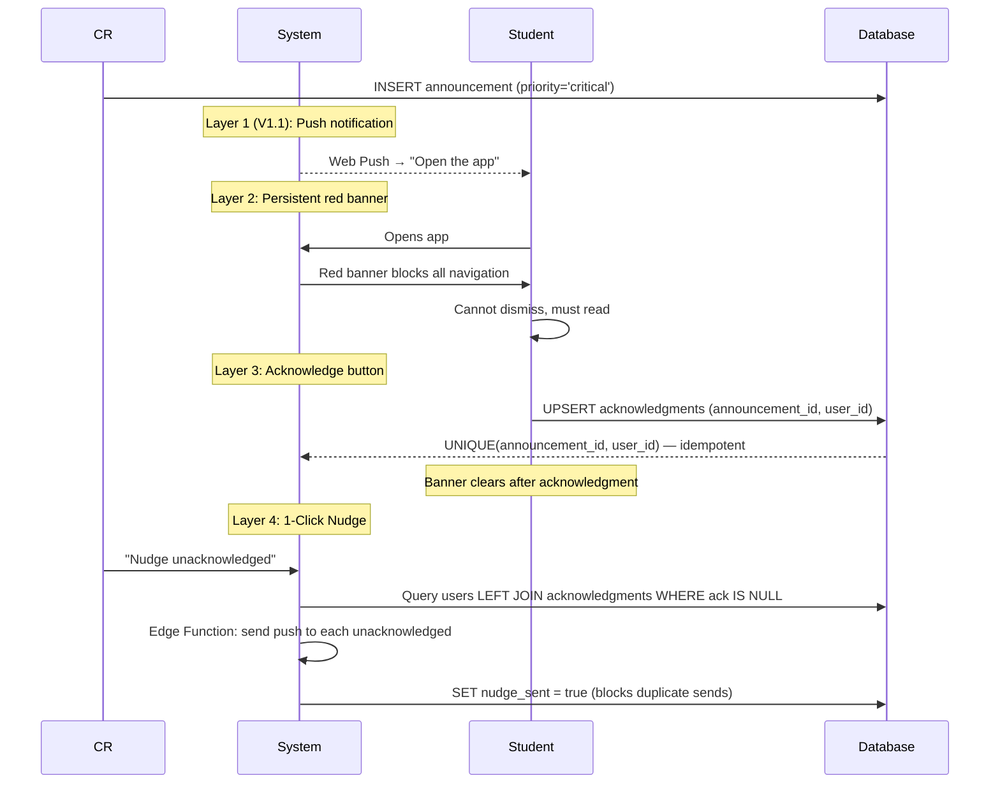

# SectionHub — Architecture Understanding

> Proving comprehension of the full project architecture before any code is written.

---

## Part 1: Summary

### Product Purpose

SectionHub is a **mobile-first Progressive Web App** for **college section management and academic coordination** at SKIT Jaipur. It replaces the previous static Resource Hub V1 with a multi-tenant, database-backed system.

It is **NOT** a social media app, LMS clone, chat app, or decorative portal.  
It **IS** an academic operations platform — a productivity-first dashboard for students and a CR operational control system.

V1.0 is a **closed beta** targeting **Section P2** (~70 students). The system is architected for future multi-section scaling.

---

### User Roles

| Role | Identity | Scope | Purpose |
|------|----------|-------|---------|
| **Student** (`role = 'student'`) | SKIT student with `@skit.ac.in` Google account | Section-scoped, own data | View assignments (personalized to roll number), check attendance predictions, read announcements, acknowledge critical notices, vote in polls |
| **CR** (`role = 'cr'`) | Class Representative, elevated permissions | Section-scoped, elevated | Post notices (general + critical), create assignments with roll-range sets, track submissions, run polls (general + actionable), view acknowledgment analytics, send nudges, manage timetable |

> **Key:** CR permissions are elevated but **still section-scoped**. There is no superadmin role in V1.0. CR is identified by a role column on the `users` table — not a separate table (ADR-011).

---

### Tech Stack

| Layer | Technology |
|-------|-----------|
| **Frontend** | React 18, Vite, TypeScript (strict mode) |
| **Styling** | Tailwind CSS v3 + shadcn/ui primitives |
| **State** | TanStack Query v5 (server state), Zustand (client-only UI state) |
| **Forms** | React Hook Form + Zod |
| **Charts** | Recharts |
| **Icons** | Lucide React (no other icon library) |
| **PWA** | vite-plugin-pwa |
| **Backend** | Supabase (PostgreSQL 15, Auth, Edge Functions) |
| **Auth** | Google OAuth via Supabase Auth, domain-restricted to `@skit.ac.in` |
| **Deploy** | Vercel (frontend), Supabase Cloud (backend) |

---

### Architecture Philosophy

1. **Security first.** Priority order: Security → Clarity → Reliability → Mobile usability → Performance → Visual polish. Never sacrifice data isolation or role boundaries for aesthetics.
2. **No separate API server.** Supabase handles everything — auth, database, edge functions. The frontend talks directly to Supabase using the publishable key.
3. **RLS is the authorization layer.** PostgreSQL Row Level Security is the primary enforcement mechanism, not frontend guards.
4. **Defense in depth.** Both RLS policies AND application-level `section_id` filters must exist on every query. If one fails, the other catches it.
5. **Schema is the source of truth.** `docs/schema.sql` is canonical. No schema drift. No tables added without PM sign-off and a new ADR.
6. **Feature-based frontend architecture.** Code organized by feature domain, not by file type.
7. **No localStorage for user data.** All persistence in Supabase for multi-device consistency.

---

### Major Product Features

| # | Feature | Description |
|---|---------|-------------|
| 1 | **Personalized Assignment Sets** | Professors assign different work to different roll number ranges. Students see only their assigned set. Major product differentiator. |
| 2 | **Critical Announcement System** | Four-layer accountability: Push (V1.1) → Persistent red banner → Acknowledge button → 1-Click Nudge to unacknowledged students. |
| 3 | **Attendance Predictions** | Students paste ERP text; app parses aggregate data (attended/total per subject). Shows debarment risk, can-skip, and must-attend calculations. No raw class logs stored. |
| 4 | **Two-Type Poll System** | General polls are truly anonymous (no `student_id` ever). Actionable polls let CR see individual responses, with a visible warning badge before the student votes. |
| 5 | **Invite-Code Onboarding** | OAuth proves SKIT identity; invite code proves section membership. CR generates/rotates invite codes. |
| 6 | **CR Command Center** | Dense operational dashboard: assignment management, notice creation, acknowledgment tracking, poll creation, submission tracker, timetable CRUD, analytics. |
| 7 | **Quick-Cast Templates** | Announcement templates (`is_template = true`) for rapid CR operations. |
| 8 | **Web Push Notifications** | V1.1 feature. Infrastructure (table, VAPID, service worker handler) built in V1.0 sprint to avoid future migration. |

---

### Security Model

1. **Authentication:** Google OAuth restricted to `@skit.ac.in` domain. Enforced at **two layers**:
   - Frontend: `onAuthStateChange` checks domain, signs out non-SKIT emails immediately
   - Database: PostgreSQL trigger on `auth.users` rejects non-SKIT emails

2. **Authorization:** RLS policies on every table. Scoped by:
   - `section_id` (tenant isolation)
   - `auth.uid()` (identity)
   - `users.role` (permission level)

3. **General poll privacy:** `votes.student_id` is **never** exposed in any query for `poll_type = 'general'`. Enforced via a Postgres view (`general_poll_results`) that only returns aggregated COUNT.

4. **No credential storage:** No ERP passwords, no API keys in tables. Supabase Vault for secrets.

5. **`users.id = auth.users.id`:** Never generate a separate UUID. The PK is always Supabase `auth.uid()`.

6. **`created_by` / `author_id` with `ON DELETE RESTRICT`:** Prevents ghost records if a user is deleted.

---

### Frontend Design Direction

**Student UI:**
- Calm, fast-scanning, low cognitive load
- Material You / Google Classroom / modern Android productivity app inspired
- Mobile-first (375px base), Android-first usability
- Bottom nav: Home, Assignments, Polls, Profile
- Dark theme with specific design tokens (electric violet accent `#8B5CF6`, dark backgrounds, semantic status colors)

**CR UI:**
- Operational, denser, analytics-oriented
- Linear / Notion / admin dashboard inspired
- Sidebar or dense dashboard nav
- Command Center as home screen

**Typography:** IBM Plex Mono (labels/metadata), IBM Plex Sans (body), Bebas Neue (display/countdown numbers)

**Hard rules:** No inline styles, no data fetching in components (hooks only), no arbitrary Tailwind values unless necessary, minimum 44px touch targets, loading + error states required on every data-consuming component.

---

### Backend Constraints

1. **12 tables locked for V1.0** — no additions without PM sign-off + new ADR
2. **No separate API server** — Supabase handles everything
3. **Every query must include `section_id`** for section-scoped tables (announcements, assignments, submissions, polls, votes, subjects, attendance_records)
4. **RLS policies require explicit flagging** — never written or applied silently
5. **Edge Functions** (Deno runtime) for privileged operations: `send-push-notification`, `nudge-unacknowledged`
6. **UPSERT patterns:** `ON CONFLICT DO UPDATE` for attendance, `ON CONFLICT DO NOTHING` for acknowledgments
7. **No Storage in V1.0** — Supabase Storage is reserved for V2
8. **Realtime is for freshness, not authorization** — data access is always gated by RLS

---

## Part 2: Deep-Dive Explanations

### How Tenant Isolation Works

SectionHub is a **multi-tenant system where each section is a tenant**. Isolation works through three reinforcing layers:



1. **`sections` table** is the workspace root. Each section has a UUID `id` and a unique `invite_code`.
2. **Every section-scoped table** (`announcements`, `assignments`, `subjects`, etc.) has a `section_id UUID REFERENCES sections(id)` column.
3. **Users are bound to a section** via `users.section_id`. This is set during onboarding when the student enters a valid invite code.
4. **RLS policies** use subqueries like `section_id = (SELECT section_id FROM users WHERE id = auth.uid())` to ensure a user can only see rows matching their own section.
5. **Application code also filters** by `section_id` — defense in depth. Even if RLS has a bug, the app-level filter prevents cross-section leakage. Even if the app filter is missing, RLS catches it.

> **ADR-010 rule:** If you write a Supabase query touching section-scoped tables without a `section_id` filter, **it is a bug** — regardless of whether RLS would catch it.

---

### How Authentication Differs from Authorization

This is explicitly called out in **ADR-013** as a deliberate architectural separation:

| Concern | Mechanism | What it proves |
|---------|-----------|----------------|
| **Authentication** | Google OAuth via Supabase Auth | *"You are who you claim to be."* The user has a valid `@skit.ac.in` Google account. |
| **Authorization** | RLS policies + `users.role` + `section_id` | *"You are allowed to do this specific thing."* The user has the correct role and belongs to the correct section. |

**Concrete flow:**

```
Authentication (identity):
  Google OAuth → Supabase Auth → email domain check → auth.users row exists
  
  ↓ proves: "This is student X from SKIT"
  
Authorization (permissions):
  users.role = 'student' | 'cr' → section_id binding → RLS policy evaluation
  
  ↓ proves: "Student X can read announcements in section P2"
             "Student X cannot read section P1 data"
             "Student X cannot create announcements (only CRs can)"
```

A user can be **authenticated** (valid Google login) but **not authorized** (no section yet, wrong role). The invite code onboarding bridges this gap — OAuth proves SKIT identity, the invite code proves section membership.

---

### How Assignment Set Routing Works

This is the **"Chaotic Professor" feature** (ADR-007) — a major product differentiator.

**Problem:** Professors assign different page ranges or PDFs to different roll number groups. Example:
- Roll P-01 to P-25: Set A, Pages 4–5
- Roll P-26 to P-50: Set B, Pages 6–7
- Roll P-51 to P-70: Set C, Pages 8–9

**Schema:**
```
assignments (1) ──→ (N) assignment_sets
                         ├── set_label: "A"
                         ├── page_range: "Pages 4–5"
                         ├── pdf_url: "drive.google.com/..."
                         ├── roll_start: 1
                         └── roll_end: 25
```

**Routing algorithm:**

```
1. Student has section_roll = "P-17"
2. Extract numeric suffix: parseInt("P-17".replace("P-", "")) → 17
3. Query:
   SELECT set_label, page_range, pdf_url
   FROM assignment_sets
   WHERE assignment_id = $1
     AND roll_start <= 17
     AND roll_end >= 17
   LIMIT 1;
4. Student sees only Set A, "Pages 4–5"
```

**Guard rails:**
- `UNIQUE(assignment_id, set_label)` — no duplicate labels per assignment
- `UNIQUE(assignment_id, roll_start, roll_end)` — no overlapping ranges
- CR form must validate no overlap before INSERT
- **If no rows exist** in `assignment_sets` for an `assignment_id`, all students see the base `assignments.description` (universal assignment, no sets)

---

### How Critical Acknowledgment Flow Works

This is the **Four-Layer Accountability System** (ADR-012):



**Database mechanics:**
- `announcements.priority = 'critical'` flags the notice
- `acknowledgments` table: `UNIQUE(announcement_id, user_id)` — each student can acknowledge once, idempotent with `ON CONFLICT DO NOTHING`
- `announcements.nudge_sent` boolean: set `true` after first nudge to prevent duplicate sends. Must be manually reset for a second nudge.

**CR visibility:**
```sql
-- Acknowledged count vs total students
SELECT
  COUNT(a.id) AS acknowledged_count,
  (SELECT COUNT(*) FROM users WHERE section_id = $1 AND role = 'student') AS total_students
FROM acknowledgments a
WHERE a.announcement_id = $2;
```

**Nudge targeting:**
```sql
-- Find students who haven't acknowledged
SELECT u.id, u.name, p.endpoint, p.p256dh, p.auth
FROM users u
LEFT JOIN acknowledgments a ON a.user_id = u.id AND a.announcement_id = $1
LEFT JOIN push_subscriptions p ON p.user_id = u.id
WHERE u.section_id = $2 AND u.role = 'student' AND a.id IS NULL;
```

The Edge Function `nudge-unacknowledged` takes `{ announcement_id, section_id }`, runs this query, loops through results calling `send-push-notification` for each device, and sets `nudge_sent = true`.

---

## Summary Table: Key Architectural Rules

| Rule | Enforcement |
|------|-------------|
| Only `@skit.ac.in` emails | Frontend check + DB trigger |
| Section isolation | RLS + application `section_id` filter (defense in depth) |
| CR-only writes | RLS `WITH CHECK` policies checking `users.role = 'cr'` |
| General poll anonymity | Postgres view with COUNT aggregate only; never SELECT `student_id` |
| No schema drift | `docs/schema.sql` is canonical; changes require PM sign-off + ADR |
| No localStorage for user data | All persistence in Supabase |
| `users.id = auth.uid()` | PK references `auth.users(id)` directly |
| Touch targets ≥ 44px | Enforced via Tailwind `min-h-[44px]` on all interactive elements |
| No `any` types | TypeScript strict mode, Zod runtime validation |
| RLS changes need confirmation | Must be flagged explicitly and wait for human approval |
