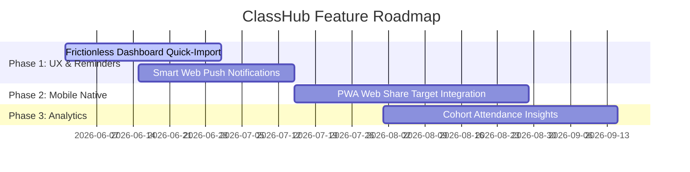

# ClassHub Project Roadmap

This document outlines the planned future features, structural enhancements, and secure user experience improvements for ClassHub. 

---

## 📅 Upcoming Milestones

---

## 🔒 Feature Specification: Secure Attendance Sync Upgrades

To solve the manual friction of attendance updating without compromising student security or violating institutional boundaries (i.e. **strictly avoiding credential storage or background scraping**), the following low-friction methods are slated for Phase 1 & 2:

### 1. Dashboard Quick-Import Banner (Phase 1)
* **Goal:** Reduce student friction to a 5-second workflow.
* **UX Flow:**
  - If a student's attendance records have not been updated for **7+ days**, a subtle, high-aesthetic alert banner appears on the dashboard home screen.
  - Clicking this banner performs two simultaneous actions:
    1. Opens the secure SKIT ERP aggregate report (`https://erp.skit.ac.in/reports/student_aggregate`) in a new browser tab.
    2. Opens the ClassHub in-app "Paste Sheet" sheet overlay.
  - The student quickly logs into ERP, presses `Ctrl + A` then `Ctrl + C`, switches back to the ClassHub tab, and clicks **Paste & Confirm**.

### 2. Smart Web Push reminders (Phase 1)
* **Goal:** Solve the problem of students forgetting to update their attendance records.
* **Engine:**
  - Connect a scheduled Supabase `pg_cron` trigger or database webhook.
  - Every Friday afternoon at **4:00 PM** (when the academic week wraps up), a secure push notification is fired to all active `push_subscriptions` on students' devices.
  - **Notification Text:** *"📊 Weekly wrap-up! Tap to sync your attendance in 5 seconds."*
  - **Interaction:** Tapping the notification launches the app directly into the Quick-Import modal.

### 3. PWA Web Share Target Integration (Phase 2)
* **Goal:** Support native mobile sharing to eliminate manual copy-pasting.
* **Mechanism:**
  - Register ClassHub as a **Web Share Target** in `public/manifest.json`.
  - When a student views their aggregate report inside Chrome/Safari on mobile, they can tap the browser's native **Share** button and select **ClassHub**.
  - ClassHub's service worker interceptor will receive the shared text, automatically direct it to the `parseERPAttendance` utility, update their records, and display a success toast.

---

## 🚫 Hard Constraints & Out-of-Scope Items

To preserve absolute privacy and protect ClassHub from security audits or credential leaks, the following items remain strictly **blacklisted** and will never be implemented:

* **❌ ERP Credentials Storage:** Storing user credentials (usernames/passwords) in local storage, cookies, or the Supabase database.
* **❌ Programmatic Background Scrapers:** Using server-side headful/headless browsers (Puppeteer, Playwright) or mock HTTP clients that log into ERP on behalf of students.
* **❌ Syllabus Trackers / Community Uploads:** Other unauthorized community file repositories or scraping hubs.
