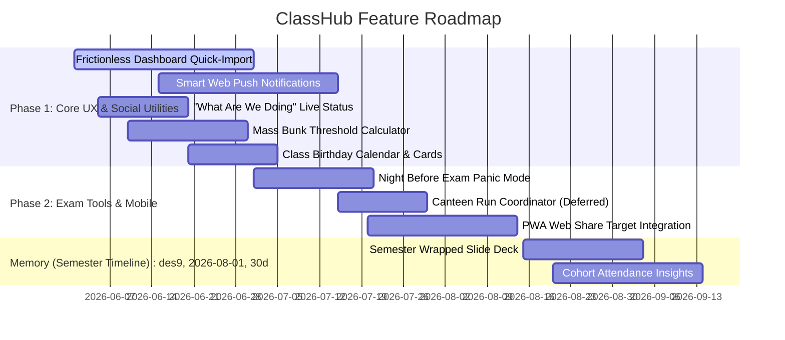

# ClassHub Project Roadmap

This document outlines the planned future features, structural enhancements, and secure user experience improvements for ClassHub.

---

## 📅 Upcoming Milestones

---

## ⚡ The P2 Superpower Expansion Pack (Phase 1 & 2)

To drive high daily engagement and turn ClassHub into a core part of the section's classroom culture, the following social, gamification, and real-time coordination tools are slated for integration:

### 1. Ephemeral "What Are We Doing" Live Status (Phase 1)
* **Goal:** Eradicate 90% of chaotic WhatsApp "where is class?" spam.
* **Mechanism:**
  - The CR gets a 1-click status widget in the Command Center with quick presets (*"Sir is late"*, *"Room shifted"*, *"Lab cancelled"*).
  - Toggling a status updates the `sections` table (`live_status` and `live_status_expires_at`).
  - Active status is displayed as a sleek, glowing banner at the absolute top of the dashboard.
  - **Auto-Expiry:** The banner automatically disappears client-side after **4 hours** (`NOW() > live_status_expires_at`).
  - **Push Notification:** The CR can check a box to instantly dispatch a lock-screen push notification to all P2 active device subscriptions.

### 2. Mass Bunk Threshold Calculator (Phase 1)
* **Goal:** Coordinate class bunks anonymously, securely, and with high social confidence.
* **Mechanism:**
  - The CR launches a pre-filled template poll from the Polls tab: *"Are we mass bunking [Subject] at [Time]?"*.
  - Poll type is locked to `general` (strictly anonymous, no `student_id` stored).
  - The dashboard poll card renders a live progress bar toward a **65% section-wide threshold**.
  - As students vote "Bunk", the bar fills. Once it crosses 65%, the UI glows neon green: *"🚨 MASS BUNK IN EFFECT — Stay Safe."*

### 3. Class Birthday Calendar & Celebration Cards (Phase 1)
* **Goal:** Foster a tight-knit section community without any manual tracking efforts.
* **Mechanism:**
  - Students optionally enter their birthday (`birthday` DATE column in `users` table) during onboarding.
  - A dashboard sidebar widget displays upcoming birthdays this week (hiding birth year/age for privacy).
  - In the CR Command Center, the CR receives a notification with a **"Celebrate Amit"** button on their birthday.
  - Clicking it instantly publishes an interactive birthday card to the class feed, complete with virtual cake and confetti animations.

### 4. Night Before Exam "Panic Mode" (Phase 2)
* **Goal:** A hyper-focused exam preparation workspace that changes based on timing.
* **Mechanism:**
  - Automatically triggers **48 hours** before any major exam/assignment due date on the schedule.
  - The dashboard UI shifts to an intense, high-aesthetic dark-red theme with a prominent, ticking countdown clock.
  - Tapping a **"My Checklist"** button opens a bottom-sheet allowing each student to create, persist, and check off their personal to-do study list (`personal_exam_tasks` table) for that specific subject.

### 5. Section Memory: Interactive Semester Timeline (Phase 3)
* **Goal:** A nostalgic, rolling history log that documents the section's semester.
* **Mechanism:**
  - Housed in a premium sub-page within the student's **Profile Page**.
  - **Auto-Events:** The app automatically logs major events to the `section_memories` table (e.g., *"Week 4: Attendance dipped to a historic low of 35%"*, *"First assignment posted"*).
  - **Manual Events:** The CR can add manual entries with custom text, dates, and optional photo URLs (e.g., *"Section P2 won the volleyball championship!"*).
  - Timeline can be exported as a beautiful, shareable PDF memory card at the end of the term.

### 6. Semester Wrapped Slide Deck (Phase 3)
* **Goal:** The ultimate viral signature feature. A Spotify-style tap-deck summarizing personal and class-wide statistics.
* **Mechanism:**
  - Unlocks on the final day of classes, triggered manually by the CR in the Command Center.
  - Displays full-screen horizontal slides with smooth transitions, gradients, and custom animations:
    1. **"The Attendance Hero"** — Your highest vs. lowest attendance subjects & survival index.
    2. **"The Night Owl / Speed Runner"** — Your submission times and proximity to deadlines.
    3. **"Section P2's Classroom Vibe"** — Core aggregate stats (top class-wide subject, total polls voted on, total announcements).
  - Ends with a shareable graphic that students can screenshot.

---

## 🔒 Feature Specification: Secure Attendance Sync Upgrades

To solve the manual friction of attendance updating without compromising student security or violating institutional boundaries (i.e. **strictly avoiding credential storage or background scraping**), the following low-friction methods are slated for Phase 1 & 2:

### 1. Dashboard Quick-Import Banner (Phase 1)
* **Goal:** Reduce student friction to a 5-second workflow.
* **UX Flow:**
  - If a student's attendance records have not been updated for **7+ days**, a subtle, high-aesthetic alert banner appears on the dashboard home screen.
  - Clicking this banner opens the secure SKIT ERP aggregate report in a new tab and opens the ClassHub in-app "Paste Sheet" sheet overlay.
  - The student quickly logs into ERP, presses `Ctrl + A` then `Ctrl + C`, switches back, and clicks **Paste & Confirm**.

### 2. Smart Web Push reminders (Phase 1)
* **Goal:** Solve the problem of students forgetting to update their attendance records.
* **Engine:**
  - Connect a scheduled Supabase database webhook or cron trigger.
  - Every Friday afternoon at **4:00 PM**, a secure push notification is fired to all active `push_subscriptions` on students' devices.

### 3. PWA Web Share Target Integration (Phase 2)
* **Goal:** Support native mobile sharing to eliminate manual copy-pasting.
* **Mechanism:**
  - Register ClassHub as a **Web Share Target** in `public/manifest.json`.
  - When a student views their aggregate report inside Chrome/Safari on mobile, they can tap the browser's native **Share** button and select **ClassHub**.
  - ClassHub's service worker interceptor automatically parses the shared text and updates their records.

---

## 🚫 Hard Constraints & Out-of-Scope Items

To preserve absolute privacy and protect ClassHub from security audits or credential leaks, the following items remain strictly **blacklisted** and will never be implemented:

* **❌ ERP Credentials Storage:** Storing user credentials (usernames/passwords) in local storage, cookies, or the Supabase database.
* **❌ Programmatic Background Scrapers:** Using server-side headful/headless browsers (Puppeteer, Playwright) or mock HTTP clients that log into ERP on behalf of students.
* **❌ Syllabus Trackers / Community Uploads:** Other unauthorized community file repositories or scraping hubs.
* **❌ Canteen Money Tracking:** Keeping ledger balances, online payments, or digital wallet systems inside the app (to keep the Canteen Coordinator lightweight and avoid financial regulatory risks).
