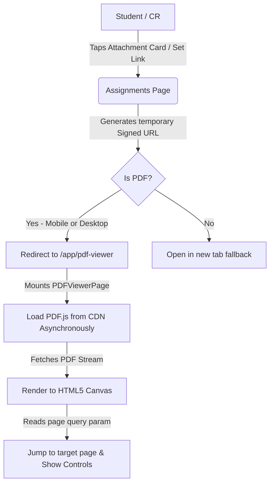

# Assignment System Overhaul & In-App PDF Viewer Design Spec

This document details the architectural design and styling specification to elevate the ClassHub assignment system across mobile and desktop. It addresses mobile PDF page jumping issues, provides flexible sorting/filtering, and ensures a modern, highly responsive, glassmorphic UI.

---

## 1. Objectives

- **Solve Mobile PDF Navigation**: Bypasses mobile browser limitations where URL hashes like `#page=X` are ignored. We implement a lightweight, CDN-driven, client-side PDF renderer (`pdf.js` loaded inside a `<canvas>`) that opens instantly and jumps to the precise page.
- **Enhanced Discoverability**: Replaces standard filter tabs with a scrollable subject scroller with assignment counts, and a tactile sorting toggle.
- **Security & Privacy Scoping**: Works inside the client's secure app container using temporary Supabase signed URLs, respecting section-level Row-Level Security (RLS).
- **Rich Aesthetics**: Premium mobile-first dark interface matching the existing glassmorphic style with micro-animations.

---

## 2. Technical Architecture & Data Flow



### Routing Changes
We introduce a new route inside [App.tsx](file:///e:/HIMANSHU/1ST_YEAR_Project/ClassHub-1/src/App.tsx) wrapped in standard authorization and hub checks:
- **Path**: `/app/pdf-viewer`
- **Query Parameters**:
  - `url` (decoded signed URL from Supabase storage)
  - `page` (target page to jump to)
  - `title` (title of the assignment for display)
  - `range` (full page range assigned to the student, e.g. `3-4`)

---

## 3. UI/UX Specifications (ui-ux-pro-max compliant)

### Assignments Page Filters
We will overhaul the header of [AssignmentsPage.tsx](file:///e:/HIMANSHU/1ST_YEAR_Project/ClassHub-1/src/pages/app/AssignmentsPage.tsx) with:
1. **Sticky Glass Header**: Keeps header in view with `backdrop-filter: blur(16px)` and solid bottom boundary.
2. **Subject Scroller (Horizontal Flex)**: 
   - A swipeable row of pill-buttons with count indicators: e.g., `All`, `DBMS (2)`, `OS (1)`.
   - Scrollable in x-axis with standard touch physics, hiding scrollbars for premium look.
3. **Sort Toggle Bar**:
   - Status filters (`All`, `Pending`, `Submitted`, `Overdue`).
   - A tactile icon button that sorts items: **Due Date (Closest First)** vs **Date Added (Newest First)**, with subtle rotational visual feedback on tap.

### In-App PDF Viewer Screen
A beautiful full-screen interface featuring:
- **Sticky Control Bar (Top)**:
  - Back Button: Navigates cleanly back to the assignments list, preserving scroll/filter state.
  - Page Range Alert: A prominent, amber/orange glowing banner if viewing a specific set (e.g. *"Your Assigned Pages: 3–4"*).
  - Share & Download Buttons:
    - **Download**: Directly downloads the file with the native filename.
    - **Share**: Invokes the browser's `navigator.share` native share dialog or copies the link to the clipboard.
- **Main Viewing Canvas**:
  - Render area that auto-scales dynamically to fit the width of the mobile viewport.
  - Double-tap or pinch gesture handling for zooming.
- **Sticky Navigation Bar (Bottom)**:
  - Previous / Next buttons (min 48×48px tap targets with disabled states).
  - Page counter: `Page X of Y`.
  - Zoom Controls: `-` and `+` buttons to scale the rendering context canvas up to 3x scale.

---

## 4. Proposed File Changes

### [NEW] [PDFViewerPage.tsx](file:///e:/HIMANSHU/1ST_YEAR_Project/ClassHub-1/src/pages/app/PDFViewerPage.tsx)
- Contains the complete logic to load `pdf.js` from `cdnjs` dynamically.
- Maintains state for current page, zoom scale, loading status, and rendering context.
- Custom CSS styles inside the file to preserve scoping, utilizing standard variables (`--bg-base`, `--accent-primary`).

### [MODIFY] [AttachmentCard.tsx](file:///e:/HIMANSHU/1ST_YEAR_Project/ClassHub-1/src/components/AttachmentCard.tsx)
- Modifies `handleDownload` to check if the file is a PDF.
- If it is a PDF, instead of `window.open(url)`, it encodes the signed URL and page numbers, and redirects the user to `/app/pdf-viewer?url=...&page=...`.

### [MODIFY] [AssignmentsPage.tsx](file:///e:/HIMANSHU/1ST_YEAR_Project/ClassHub-1/src/pages/app/AssignmentsPage.tsx)
- Integrates the horizontal subject scroller, status filters, and sorting toggle.
- Refactors state to support sorting (by `dueDate` or `createdAt`) and filtering by `subjectId`.
- Fixes the PDF action link inside the assignment "Your Set" card banner to launch the new in-app viewer.
- Adds the CR edit trigger button next to the delete button and wires it to mount the pre-populated edit bottom sheet.
- Overhauls count badges inside subject pills to use a centered inline-flex layout.
- Upgrades the deadline pill logic to display status relative to urgency (`Urgent`, `Tomorrow`, `Pending`) instead of repeating the date.

### [MODIFY] [App.tsx](file:///e:/HIMANSHU/1ST_YEAR_Project/ClassHub-1/src/App.tsx)
- Imports and registers the lazy-loaded `/app/pdf-viewer` route.

### [MODIFY] [useSupabaseMutations.ts](file:///e:/HIMANSHU/1ST_YEAR_Project/ClassHub-1/src/hooks/useSupabaseMutations.ts)
- Adds a robust `useUpdateAssignment` mutation hook that updates the core assignment columns and syncs/replaces the sets in the database.

---

## 6. CR Editing, Notifications & Visual Refinements

### Subject Pill Tag Centering
We fix the alignment of the badge counts inside the subject filter buttons by converting them to a flex element:
```css
display: inline-flex;
align-items: center;
justify-content: center;
min-width: 16px;
height: 16px;
border-radius: 50%;
margin-left: 6px;
```

### Urgent & Relative Deadlines
To eliminate double due-dates on student assignment cards:
- **Badge Content**: Shows `Submitted` (green), `Overdue` (red), `Urgent` (red for <24h remaining), `Tomorrow` (orange for <48h), or `Pending` (blue/gray for >48h).
- **Secondary Line**: Shows the exact localized date/time: e.g. `Due May 22, 11:30 PM`.

### Physical PDF Zooming
In `PDFViewerPage.tsx`, to make zooming highly interactive:
- Enable horizontal/vertical overflow by setting the wrapper style to `overflow: auto`.
- Dynamically scale the CSS display dimensions of the canvas relative to the `scale` state:
  ```typescript
  canvas.style.width = `${containerWidth * scale}px`;
  canvas.style.maxWidth = 'none';
  canvas.style.height = 'auto';
  ```
- Center the canvas element inside the scroll parent when smaller than viewport width using standard block centering: `margin: auto`, `display: block`.

### CR Editing & Notification Flow
- **Interaction**: CRs will see a Pen/Edit icon next to the Delete icon on each assignment card. Clicking it opens the bottom sheet pre-populated with details of that assignment.
- **Sets Editing**: Allows changing individual set ranges, labels, and pages dynamically.
- **Instant Student Alert**: An toggle `[x] Notify class about updates` is added. When selected upon save, the client invokes `supabase.functions.invoke('send-custom-notification')` with customized update alerts to trigger instant Web Push notifications to all subscribed devices.

---

## 7. Verification & Test Plan

### Automated Verification
- Run compilation checks: `npm run build`
- Validate ESLint standards: `npm run lint`
- Run Vitest suite: `npm test`

### Manual Quality Checklist
1. **Responsive Viewports**: Test screen sizing at `375px`, `768px`, and `1440px`.
2. **Horizontal/Vertical Zoom Scrolling**: Enlarge the PDF to `150%` and `200%` scale; verify you can swipe horizontally to read fine text on mobile devices without it snapping or getting clipped.
3. **Pill Badge Alignment**: Verify circular count badges are visually centered.
4. **CR Edit Workflow**: Modify an assignment's deadline and title. Check that the updates sync to the database and optionally trigger a notification.
5. **No Double Due-Dates**: Confirm that standard pending assignments do not duplicate absolute dates across badges and secondary lines.

