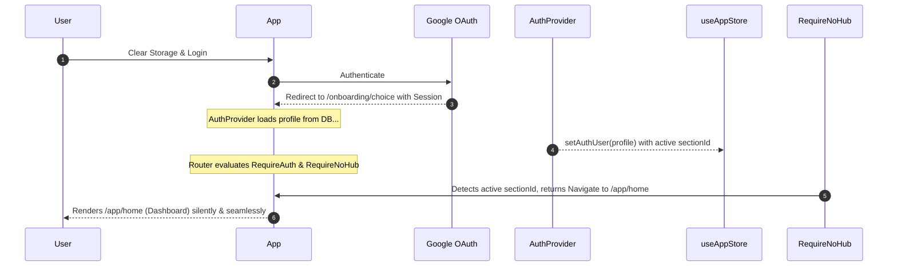

# Design Specification — Onboarding Redirection & Roll Validation Alignment

**Author:** Antigravity (AI Architect)  
**Date:** 2026-05-24  
**Status:** Approved (Approach A)  

---

## 1. Context & Problem Statement

ClassHub uses a multitenant database model where users are assigned to specific sections (hubs) via a `section_id` in the `users` table.

When a user cleared their site storage in the browser, their local Zustand store state (session + `authUser` cached profile) was wiped. However, their database row in the `users` table remained fully active with their correct `section_id` and role (`student` or `cr`).

Upon logging back in with Google OAuth, the identity provider redirected the user back to the OAuth redirect landing page: `/onboarding/choice`.
*   **The Bug**: Because `/onboarding/choice` was not protected against already-onboarded users, they were presented with the "Join a Hub" and "Create a Hub" cards, despite already having a database profile.
*   **The Failure**: When attempting to join a default hub (`P2WXYZ`), the database correctly raised an `Invalid invite code` exception, or would have raised constraint violations due to their existing roles.

Furthermore, there is a mismatch between the frontend university roll validator and the database check constraint `users_university_roll_check`. This spec addresses both issues.

---

## 2. Proposed Architecture (Approach A)

### A. Router-Level Route Guard (`RequireNoHub`)
We will implement a `RequireNoHub` route guard component in `src/App.tsx`. This guard will verify if the user already has a `sectionId` set in their profile. If they do, they are redirected silently and immediately to their home dashboard.

```typescript
// ── No Hub guard — blocks already-onboarded users from onboarding routes ──
function RequireNoHub({ children }: { children: React.ReactNode }) {
  const authUser = useAppStore(s => s.authUser);
  
  if (authUser?.sectionId) {
    return <Navigate to="/app/home" replace />;
  }
  return <>{children}</>;
}
```

This guard will wrap:
*   `/onboarding/choice`
*   `/onboarding/join`
*   `/onboarding/create`

Because `RequireAuth` already handles the asynchronous loading state (`isAuthLoading`) by showing a skeleton loading screen until the Supabase user session and database profile are fully fetched, `RequireNoHub` has access to the resolved `authUser` profile instantly when rendering, preventing visual flashes.

### B. Regex Validation Alignment
We will align the local `uniRollRegex` in both `JoinHubPage.tsx` and `CreateHubPage.tsx` to strictly enforce the standard SKIT RTU enrollment pattern (e.g. `25ESKIT157`):
- Last 2 digits of the year of admission (e.g. `25` for 2025)
- Exactly 5 letters starting with `ESK` (e.g. `ESKIT`, `ESKCS`, `ESKCX`)
- Exactly 3 digits for the roll sequence number (e.g. `157`, `045`)

The existing database constraint (`^[0-9]{2}[A-Z]{3,7}[0-9]{2,5}$`) already permits this strict pattern perfectly as a valid subset, so no database migration is required.

**Strict Frontend Regex**:
```typescript
const uniRollRegex = /^[0-9]{2}[A-Z]{5}[0-9]{3}$/;
```

---

## 3. Data Flow & Routing Life Cycle



---

## 4. Testing & Verification

### Automated Tests
1. Run `npm test` to verify validation schemas do not regress.

### Manual Verification
1. Log in with an onboarded user, manually navigate to `/onboarding/choice`, and verify that you are immediately redirected to `/app/home` without seeing the onboarding choice page.
2. Log in with a new user (with no section ID) and verify that you are allowed to view the `/onboarding/choice`, `/onboarding/join`, and `/onboarding/create` pages normally.
