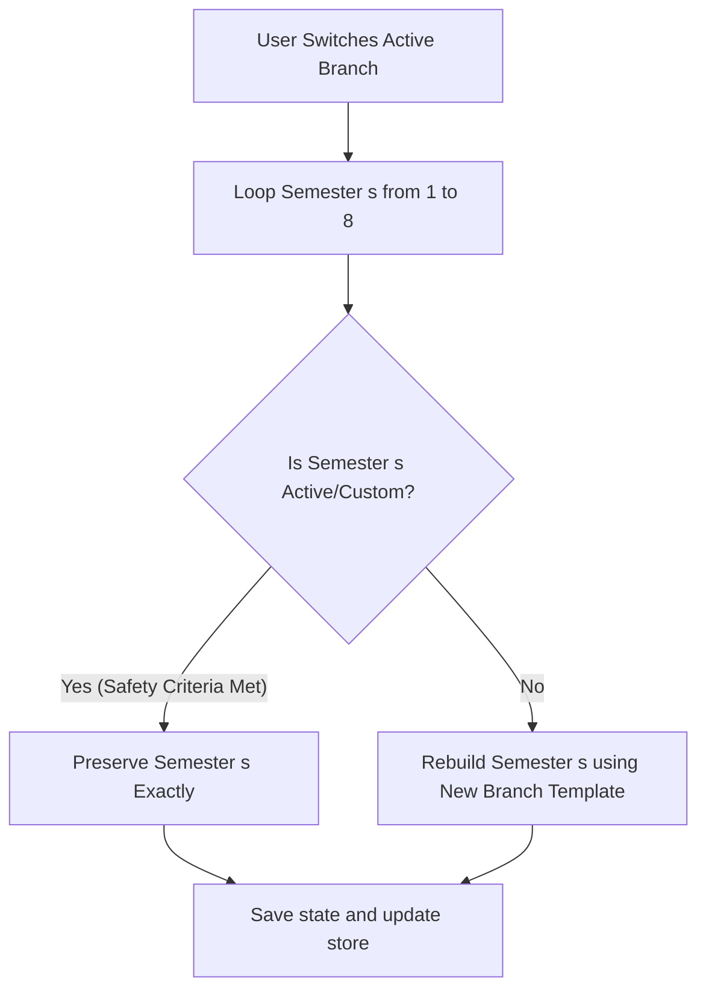

# Design Specification: GPA Calculator Precision Refinements & UX Upgrades

This document specifies the design for the logic, accessibility, and user experience (UX) refinements of the PWA GPA Calculator in ClassHub.

---

## 1. Store Logic Safeguard: Branch-Switch Protection

### Problem Statement
Currently, when a student changes their branch in the GPA Calculator, the global store `useGPAStore` rebuilds *every* semester's subject list, overwriting the names and credits of all semesters and mapping the user's entered marks purely by index position. This causes:
1. Scrambled grades if the new branch's default subjects are in a different order.
2. Truncation or complete loss of manually added custom subjects.
3. Overwriting of completed or locked historical semesters.

### The Refinement
We will introduce a **Branch-Switch Safeguard** in `src/store/gpaStore.ts` that preserves custom data:



#### Safety Criteria
A semester is marked as **Active/Custom** and is protected from branch-switching changes if:
* The semester is locked (`locked === true`).
* Any subject in the semester has non-null marks (`sub.marks !== null`).
* The subjects array length does not match the default template count (meaning the user has added or removed subject rows).

---

## 2. Precise Target CGPA Predictor & Insight Tiers

### Problem Statement
In the `GoalsTab`, the target CGPA predictor under-estimates completed credits and over-estimates remaining credits because:
1. It treats the active semester as fully finished once it has a single mark, ignoring unentered subjects.
2. It classifies targets in a binary way (either possible or impossible).

### The Refinement
We will update the mathematical prediction and visual cards:

#### 1. Mathematical Formula
* **Completed Subjects**: Any subject in any semester (including the active one) that has non-null marks.
* **Remaining Subjects**: Any subject in any semester that has null marks (including unentered subjects in the current active semester) + all subjects in untouched semesters (assumed at 20 credits per semester).
* **Required Average SGPA**:
  $$\text{Required SGPA} = \frac{(\text{Target CGPA} \times \text{Total Future Credits}) - \text{Current Weighted Score}}{\text{Remaining Credits}}$$

#### 2. Visual Challenge Classification Tiers
The insights card will dynamically adapt its colors and text based on the difficulty of the target:

| Required average SGPA | Difficulty Tier | Card Styling | Visual Indicator |
| :--- | :--- | :--- | :--- |
| **> 10.0** | `Impossible` | 🔴 Muted Red Card (`rgba(239,68,68,0.08)`) | "This target is mathematically out of range." |
| **9.0 to 10.0** | `Extreme Challenge` | 🟡 Muted Amber Card (`rgba(245,158,11,0.08)`) | "Extreme challenge! Requires near-perfect O/A+ grades." |
| **<= 9.0** | `Realistic` | 🟢 Muted Sage Card (`rgba(52,211,153,0.08)`) | "Target is achievable with steady academic performance." |

---

## 3. Keyboard Focus States & A11y Standards

We will achieve complete compliance with **Vercel Web Interface Guidelines** and WCAG accessibility standards inside `GPACalculatorPage.tsx`:

### Interactive Focus States
Since inline styles do not support `:focus` natively, we will implement focus state hooks (`onFocus`/`onBlur`) for the three main inputs in the subjects table row:
* **Subject Name Input**: When focused, replaces transparency with a subtle dark base, outline: `none`, and border-color transitions to active.
* **Credits Input & Marks Input**: Smooth outline removal, rendering a clear desaturated accent border glow (`var(--accent-primary)`) to signal keyboard focus.

### Accessible Labels (aria-labels)
Every control will have explicit labels and indicators:
* **Credit Input**: `aria-label="Credits for [Subject Name]"`
* **Subject Name Input**: `aria-label="Subject name [Index]"`
* **Delete Button (Trash)**: `aria-label="Remove subject [Subject Name]"`
* **Modal Close Button**: `aria-label="Close review modal"`
* **Manual Prior Sem clear (X)**: `aria-label="Clear Semester [s] prior CGPA"`

---

## 4. Typography & Icons (Lucide-react)

* **Lucide Icon Integration**:
  * We will use the `Target` icon for the Goals tab visual indicators.
  * We will use `TrendingUp`, `BarChart3`, `Award`, `Trash2`, `RefreshCw`, `Lock`, `Unlock`, `Plus`, `X`, and `ChevronLeft` in high-touch interactive zones.
* **Standardized Ellipsis**: Replace all manual triple dots (`...`) with the standard ellipsis symbol (`…`) across all components, placeholders, loading states, and charts:
  * `"Scanning…"`
  * `"Loading PDF engine…"`
  * `"Analyzing text…"`
  * `"Processing image…"`
  * `"Matching subjects…"`

---

## Verification Plan

### Automated Checks
* Verify compiling stability with zero type issues or bundler errors:
  ```bash
  npm run build
  ```

### Manual Refinement Verification
1. **Branch Protection**: Load CSE, enter a grade for Semester 1, change the header branch to IT. Verify that Semester 1 subjects and marks are perfectly unchanged, while empty Semester 2 subjects are updated to IT defaults.
2. **Predictor Calibration**: Navigate to Goals Tab, move range slider. Verify that unentered active subjects are counted correctly as remaining, and the insights card changes color dynamically across Red, Yellow, and Green tiers.
3. **A11y Check**: Tab through the table inputs. Verify that each input renders a visible focus ring/border glow and has proper aria attributes.
