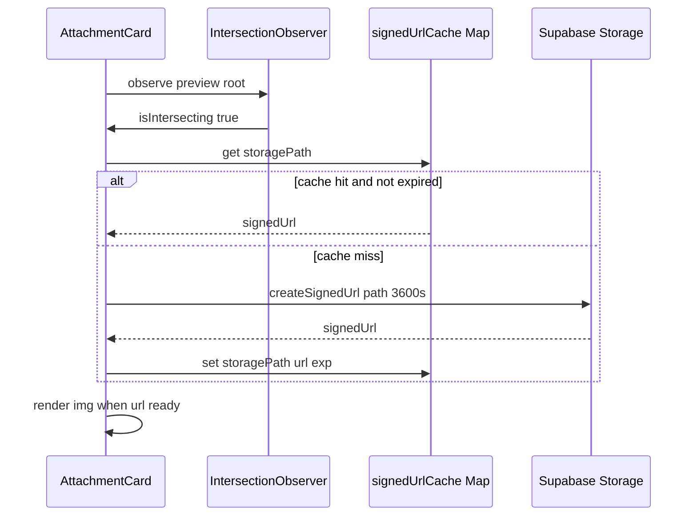

# Design Specification: Option C Quality Gate

**Project:** ClassHub (SectionHub PWA)  
**Date:** 2026-05-25  
**Status:** Approved (brainstorming + grill-me session)  
**Next step after this doc:** Implementation plan (`writing-plans` skill). No application code until the plan is reviewed.

---

## 1. Purpose

Option C is a **quality gate sprint** that closes **HIGH** and **MED** findings from UI/UX and performance audits on the Announcements feed, shared attachment image viewer, and GPA Calculator—without adding new product features. Confidence comes from **Vitest** math coverage and a **manual smoke checklist**, not from Playwright or animation libraries.

The sprint optimizes for daily-use surfaces (announcement attachments, feed scroll) before the large GPA route bundle split, so regressions are caught by tests before heavy refactors.

---

## 2. Scope

### In scope

| Area | Work type |
|------|-----------|
| **Announcements** | HIGH + MED audit fixes: responsive card layout, delete confirmation, a11y on controls and sort menu |
| **`AttachmentCard` / image viewer** | HIGH + MED perf + a11y: lazy fetch, modal extraction, pan/zoom, portal, memo, feed preview layout |
| **GPA Calculator** | HIGH + MED: bundle split (lazy tabs + dynamic heavy imports + prefetch), label honesty, tab/OCR a11y, OCR memory MED fixes |
| **Tests** | `tests/unit/gpaCalculations.test.ts` (pure `src/lib/gpaData.ts` helpers) |
| **Verification** | Manual smoke checklist (Section 8); `npm test` and `npm run build` |

### Out of scope (this sprint)

| Item | Rationale |
|------|-----------|
| **Playwright / E2E CI** | High setup cost for `@skit.ac.in` OAuth + Supabase; Vitest + manual checklist sufficient for closed beta |
| **GSAP** | Does not fix React re-render jank or feed network waterfalls; adds bundle weight |
| **Supabase Storage image transforms** (thumbnail pipeline B) | Requires backend/transform enablement; sprint uses visible-only fetch + in-memory URL cache instead |
| **GPA formula or grading scale changes** | Tests guard existing `gpaData.ts` behavior only |
| **New features** outside audit fixes (branch-switch safeguard, goals predictor tiers, etc.) | Separate specs (e.g. precision refinements) |
| **Full list virtualization** | `content-visibility` first; `@tanstack/react-virtual` only if profiling shows need on 50+ cards |
| **Dashboard / Assignments page edits** | No dedicated phase files; they **consume** shared `AttachmentCard` improvements automatically |

---

## 3. Locked decisions (grill-me)

| Topic | Decision | Notes |
|--------|----------|--------|
| **GSAP** | **No** this sprint | Revisit only for a future lazy-loaded onboarding or marketing route |
| **E2E** | **No Playwright** | **Vitest** + manual smoke checklist at end of sprint |
| **Ship order** | **B** | (1) Images + Announcements → (2) `gpaCalculations.test.ts` → (3) GPA lazy-split + GPA UI/a11y/OCR MED → (4) Manual checklist |
| **Thumbnails** | **A** | `IntersectionObserver` + optional in-memory signed-URL cache; **one full-res signed URL** for inline preview and zoom modal |
| **SGPA label** | **A** | Rename to **“Current semester SGPA”**; show **Partial** badge when active semester has some but not all marks |
| **GPA code-split** | **C** (= B + prefetch) | Lazy tab components **and** dynamic `import()` for Recharts, Nivo, `html2canvas` only inside Analytics / Report / Goals; **prefetch** tab chunk on tab `mouseenter` / `focus` |
| **Announcements layout** | **B** | Stack two-column card at **`640px`** (`sm`); desktop row layout unchanged |
| **Feed image preview** | **Orientation-aware contain** | Portrait: taller cap (~400px height); landscape: full width, ~240–280px height cap; **`object-fit: contain`**; neutral letterbox; skeleton + min-height until load |
| **Delete announcement** | **Always confirm** | **Adaptive UI:** bottom sheet below `640px`, centered dialog at `640px`+; shared copy; focus trap; Escape; **Cancel** focused first |

---

## 4. Audit inventory (HIGH + MED)

Findings below are mapped to implementation phases. Severity reflects audit + performance review consensus.

### 4.1 AttachmentCard and image viewer (shared)

| ID | Severity | Finding | Resolution |
|----|----------|---------|------------|
| IMG-1 | HIGH | `createSignedUrl` runs on every card mount, including off-screen cards | Gate fetch with `IntersectionObserver` (`rootMargin` ~200px); disconnect after first intersect |
| IMG-2 | HIGH | Full-resolution image decoded for small inline box | Same URL as modal when visible (strategy A); optional module-level `Map<storagePath, { url, exp }>` to dedupe |
| IMG-3 | HIGH | Pan/zoom uses `setState` on every `pointermove` / `wheel` → modal re-renders | Store `scale` / `pos` in **refs**; update `transform` on DOM; commit state only if UI must show scale |
| IMG-4 | HIGH | `backdrop-filter: blur(8px)` on fullscreen overlay | Solid overlay `rgba(0,0,0,0.92)` only—no backdrop blur |
| IMG-5 | HIGH | `ImageZoomModal` bundled eagerly in `AttachmentCard` chunk | Extract to `src/components/ImageZoomModal.tsx`; load with `React.lazy` + `Suspense` when modal opens |
| IMG-6 | MED | No `document.body` scroll lock under modal | `createPortal` to `document.body`; lock overflow while open (pattern from `BottomSheet.tsx`) |
| IMG-7 | MED | No Escape to close modal; weak close button a11y | `useEffect` keydown Escape; close button `aria-label="Close image preview"` |
| IMG-8 | MED | Parent list re-renders re-run all attachment subtrees | `export const AttachmentCard = memo(...)`; stable `attachment` props from TanStack Query |
| IMG-9 | MED | Long announcement lists paint full subtrees | `content-visibility: auto` + `contain-intrinsic-size` on `.announcement-card-layer` in `index.css` |
| IMG-10 | MED | Fixed 9:16 + `object-fit: cover` crops landscape notices | Orientation-aware **contain** preview (locked decision) |
| IMG-11 | MED | Missing `decoding="async"`; CLS on preview swap | Skeleton/min-height; `decoding="async"`; `fetchPriority="low"` on feed images |

**Consumers (no separate phase):** `AnnouncementsPage.tsx`, `DashboardPage.tsx`, `AssignmentsPage.tsx` all import `AttachmentCard`.

### 4.2 Announcements page

| ID | Severity | Finding | Resolution |
|----|----------|---------|------------|
| ANN-1 | HIGH | Delete runs immediately with no confirmation | Adaptive confirm sheet/dialog before `useDeleteAnnouncement` |
| ANN-2 | MED | Two-column card squeezes ack column between ~481–640px | `@media (max-width: 639px)` stack: column layout, ack/actions **100% width**, min touch height 44px |
| ANN-3 | MED | Ack tracker uses `div.tracker-pill` + `onClick` | `<button type="button">` + `aria-label` describing ack count |
| ANN-4 | MED | Sort dropdown missing menu semantics / Escape | `role="menu"`, `menuitem`, Escape and outside-click close, `:focus-visible` on items |
| ANN-5 | MED | Delete control icon-only | `aria-label="Delete announcement"` (title insufficient for SR) |
| ANN-6 | MED | Search input without accessible name | `aria-label="Search announcements"` or visible label |
| ANN-7 | MED | Deadline field label association | `htmlFor` / `id` on composer deadline where applicable |

### 4.3 GPA Calculator

| ID | Severity | Finding | Resolution |
|----|----------|---------|------------|
| GPA-1 | HIGH | `GPACalculatorPage` chunk ~903 KB min / ~256 KB gzip (Recharts + Nivo + `html2canvas` via `pdfExport`) | Lazy tab bodies; dynamic imports inside Analytics / Report / Goals only; Calculator tab stays lean |
| GPA-2 | MED | Label **“Latest SGPA”** implies last completed semester; value is **active semester** | **“Current semester SGPA”** + **Partial** badge when `getSemStatus(activeSemester) === 'partial'` |
| GPA-3 | MED | Tab strip is buttons without `tablist` / `tab` / `tabpanel` roles | WAI-ARIA tabs on main tab switcher |
| GPA-4 | MED | OCR/review modal missing focus trap and Escape | Trap focus; restore on close; Escape closes |
| GPA-5 | MED | Inline-style inputs lack visible keyboard focus | `:focus-visible` CSS classes or shared focus ring on calculator table and key controls |
| GPA-6 | MED | OCR path: `URL.createObjectURL` not revoked; large images decoded at full size | `revokeObjectURL` after OCR; downscale to max width ~1600 before Tesseract; keep existing dynamic `import('tesseract.js')` |
| GPA-7 | MED (optional) | pdf.js loaded from CDN separately in GPA OCR and `PDFViewerPage` | Shared singleton loader module if low incremental cost; otherwise defer |

**Explicitly not in this sprint:** changing `computeSGPA` / `computeCGPA` formulas or the 20-credit manual-semester proxy in `gpaData.ts`.

---

## 5. Technical design

### 5.1 Visible-only signed URLs and cache



- **Observer:** `rootMargin: '200px'`, `threshold: 0`, disconnect after first successful intersect (or on unmount).
- **Cache:** Module-level `Map<string, { url: string; expiresAt: number }>` keyed by `storagePath`; TTL slightly before Supabase expiry (e.g. 3500s for 3600s URLs).
- **Non-images:** Unchanged—short-lived URL on click for download/open.

### 5.2 ImageZoomModal (extracted)

**New file:** `src/components/ImageZoomModal.tsx`

| Concern | Approach |
|---------|----------|
| Load | `const ImageZoomModal = lazy(() => import('./ImageZoomModal'))` from `AttachmentCard` |
| Transform | Refs `scaleRef`, `posRef`; apply `element.style.transform` in rAF-throttled handlers |
| Overlay | `background: rgba(0,0,0,0.92)`; **no** `backdropFilter` |
| Mount | `createPortal(..., document.body)` |
| Scroll | `document.body.style.overflow = 'hidden'` while open; restore on cleanup |
| Keyboard | Escape → `onClose`; trap Tab within modal |
| Close control | `aria-label="Close image preview"` |
| Props | `{ url: string; onClose: () => void }` |

### 5.3 Feed preview layout (orientation-aware contain)

On `img` `onLoad`, read `naturalWidth` / `naturalHeight`:

| Orientation | Container rules |
|---------------|-----------------|
| **Portrait** (`naturalHeight >= naturalWidth`) | `max-height: 400px`; width 100%; `object-fit: contain` |
| **Landscape** | `max-height: 280px` (acceptable range 240–280px); width 100%; `object-fit: contain` |

- Remove fixed `aspect-ratio: 9/16` and `object-fit: cover` for image attachments.
- Placeholder: neutral `background` on preview box; `min-height` ~120px until loaded to limit CLS.
- Modal remains full pan/zoom on the same signed URL.

### 5.4 Announcements responsive layout (`index.css`)

Under **`max-width: 639px`** (stack below Tailwind `sm`):

```css
.announcement-card-content {
  flex-direction: column;
  align-items: stretch;
}
.announcement-card-right {
  width: 100%;
  align-items: stretch;
  min-width: 0;
}
/* Ack / delete / tracker controls: min-height 44px where touch targets apply */
```

At **`min-width: 640px`**, keep current row layout (body + ~84px ack column).

Add to `.announcement-card-layer`:

```css
content-visibility: auto;
contain-intrinsic-size: auto 320px;
```

### 5.5 Delete confirmation (adaptive)

Implement in **`AnnouncementsPage.tsx`** (or small colocated component) using existing **`BottomSheet`** patterns:

| Viewport | UI |
|----------|-----|
| `< 640px` | Bottom sheet: title, body copy, Cancel (primary focus) + destructive Confirm |
| `≥ 640px` | Centered dialog with same copy and button order |

**Copy (locked intent):** Warn that deletion removes the announcement and acknowledgment data; cannot be undone.

**Behavior:**

- Opening confirm stores `pendingDeleteId`; Confirm calls existing `deleteAnn.mutateAsync`.
- **Cancel** receives initial focus; **Confirm** uses danger styling.
- Escape and backdrop click → Cancel.
- Delete trigger: `aria-label="Delete announcement"`.

### 5.6 GPA bundle split

**File:** `src/pages/app/GPACalculatorPage.tsx` (may split tab files under `src/pages/app/gpa/` if plan prefers, but single file split is acceptable)

| Tab | Initial load | Heavy deps |
|-----|--------------|------------|
| **Calculator** | Default; always loaded on first visit | Tesseract only via existing dynamic `import()` inside OCR flow |
| **Analytics** | `React.lazy(() => import(...))` | `import('recharts')`, `import('@nivo/pie')`, etc. **inside** lazy module |
| **Report** | Lazy | `html2canvas` via dynamic import inside `pdfExport` usage path |
| **Goals** | Lazy | Charts as needed; no top-level Recharts/Nivo imports in page entry |

**Prefetch:** On tab button `onMouseEnter` and `onFocus`, call `void import('./AnalyticsTab')` (or equivalent) for the **non-active** tab to warm the chunk.

**Suspense:** Lightweight fallback (spinner or “Loading…”) per tab panel—use ellipsis character `…` per project copy rules.

**Success metric for bundle:** After build, first navigation to `/gpa` with Calculator tab only should **not** pull the full ~903 KB combined chart chunk; verify via `dist/assets` chunk list (Calculator-only entry significantly smaller than pre-split monolith).

### 5.7 SGPA label and Partial badge

**Location:** `CGPAHero` and any duplicate “Latest SGPA” strings in `GPACalculatorPage.tsx` (e.g. report summary).

- Replace **“Latest SGPA”** with **“Current semester SGPA”**.
- When active semester has `partial` status (`getSemStatus(activeSemester) === 'partial'`), show a small **Partial** badge beside the value (muted amber styling consistent with semester nav dots).

### 5.8 OCR MED fixes (`CalculatorTab`)

| Fix | Detail |
|-----|--------|
| **revokeObjectURL** | After OCR completes or file input clears, revoke blob URLs created for preview |
| **Downscale** | Before canvas/Tesseract, scale image to max width 1600 (preserve aspect) |
| **Modal a11y** | Focus trap in review modal; Escape closes; restore focus to scan trigger |

---

## 6. Implementation phases

### Phase 1 — Images and announcements

**Goal:** Fix feed network/decodes, modal jank, and announcement layout/a11y/delete flow.

| File | Changes |
|------|---------|
| `src/components/AttachmentCard.tsx` | IO-gated fetch; URL cache; `memo`; orientation-aware contain preview; lazy modal gate |
| `src/components/ImageZoomModal.tsx` | **New:** portal, scroll lock, ref pan/zoom, no backdrop blur, Escape, a11y |
| `src/pages/app/AnnouncementsPage.tsx` | Adaptive delete confirm; tracker as button; sort menu a11y; search/delete labels; wire confirm before delete |
| `src/index.css` | Stack rules ≤639px; `content-visibility` on `.announcement-card-layer`; touch target helpers |

**Phase 1 exit:** Scroll announcements feed on mobile—only visible cards request Storage URLs; open image modal smooth on mid-range Android; delete requires confirm; card stacks cleanly at 375px and 640px breakpoints.

---

### Phase 2 — GPA calculation tests

**Goal:** Lock math before GPA page refactor.

| File | Changes |
|------|---------|
| `tests/unit/gpaCalculations.test.ts` | **Create** Vitest suite importing from `src/lib/gpaData.ts` |

**Required test cases:**

1. **Grade boundaries:** marks 39 → P (4 pts); 40 → P; 89 → A; 90 → O (10 pts).
2. **SGPA:** Known subject set with credits and marks → expected weighted SGPA (2 decimal places).
3. **CGPA:** Multiple semesters with entered marks → expected CGPA.
4. **Manual history proxy:** Semester with no subject marks but `manualHistory[sem]` set → contributes **20 credits** at that SGPA value.
5. **Partial semester:** Only some subjects with marks → SGPA uses entered subjects only; empty entered set → 0.

**Phase 2 exit:** `npm test` passes with new file green.

---

### Phase 3 — GPA UI, bundle split, OCR MED

**Goal:** Reduce first-visit JS; honest labels; tab/OCR accessibility.

| File | Changes |
|------|---------|
| `src/pages/app/GPACalculatorPage.tsx` | Lazy tab components; remove top-level Recharts/Nivo/html2canvas imports; dynamic imports inside Analytics/Report/Goals; tab prefetch on hover/focus; WAI-ARIA tabs; SGPA label + Partial badge; OCR MED fixes in `CalculatorTab` |
| `src/lib/pdfExport.ts` (if needed) | Ensure `html2canvas` only loaded from Report export path via dynamic import |

**Phase 3 exit:** `npm run build` shows smaller initial GPA chunk; tab switch to Analytics after prefetch feels instant; OCR no longer leaks object URLs on repeated scans.

---

### Phase 4 — Manual smoke checklist

Run once after Phases 1–3. Record pass/fail in PR notes or sprint log.

| # | Steps | Expected |
|---|--------|----------|
| 1 | Open **Announcements**; scroll feed with 3+ image attachments | Images load only when scrolled near viewport; no mass Storage calls on initial paint |
| 2 | Tap image preview → pan/zoom → **Escape** | Modal opens without severe jank; Escape closes; background does not scroll |
| 3 | **Delete** announcement (CR account) → **Cancel** → delete again → **Confirm** | Confirm always shown; Cancel aborts; Confirm deletes and toast shows |
| 4 | Narrow viewport **375px** and **639px** | Card stacks; ack button full width; tracker and delete usable |
| 5 | Open **GPA Calculator**; enter marks for 2 subjects in active sem | **Current semester SGPA** updates; **Partial** badge visible until all subjects filled |
| 6 | Compare SGPA/CGPA to fixture from unit tests | Matches `gpaCalculations.test.ts` expectations |
| 7 | Hover **Analytics** tab ~1s → click | Tab opens without long blank stall (prefetch) |
| 8 | Run OCR once (image or PDF); repeat with second file | No runaway memory; second scan works |
| 9 | `npm test` | All tests green |
| 10 | `npm run build` | Success; note `GPACalculatorPage` chunk size vs pre-sprint ~903 KB monolith |

---

## 7. Success criteria

| Criterion | Verification |
|-----------|--------------|
| Unit tests | `npm test` exits 0; `gpaCalculations.test.ts` covers boundaries, SGPA, CGPA, 20cr proxy, partial semester |
| Build | `npm run build` exits 0 |
| GPA bundle | First Calculator-only visit loads substantially less JS than pre-split (~903 KB single chunk broken apart) |
| Announcements network | Visible-only signed URL pattern; scroll no longer triggers N×M parallel fetches for off-screen cards |
| Math unchanged | No edits to grading scale or `computeCGPA` weighting rules without test updates |
| Accessibility | Delete confirm, modal, and tab strip meet locked a11y behaviors (focus trap, Escape, labels) |
| No scope creep | No Playwright, GSAP, or Supabase transform URLs shipped |

---

## 8. Dependencies and risks

| Risk | Mitigation |
|------|------------|
| Lazy tab causes layout shift | Consistent `Suspense` fallback height in tab panel |
| Prefetch on mobile absent hover | `onFocus` also prefetches; first open may still load chunk—acceptable |
| Variable-height image cards in feed | `contain-intrinsic-size` + skeleton; accept variable card height vs cropped thumbs |
| Shared `AttachmentCard` regression on Dashboard/Assignments | Smoke checklist item 1–2 on Announcements; spot-check Dashboard attachment strip |
| OCR downscale reduces recognition accuracy | Cap 1600px width—sufficient for mark sheets; monitor in smoke step 8 |

---

## 9. References

| Resource | Path |
|----------|------|
| GPA data & formulas | `src/lib/gpaData.ts` |
| GPA store | `src/store/gpaStore.ts` |
| Attachment utilities | `src/lib/utils/attachments.ts` |
| Bottom sheet scroll lock pattern | `src/components/BottomSheet.tsx` |
| Performance audit (image viewer) | Agent transcript `7491e1aa` / performance subagent |
| Grill-me locked decisions | Agent transcript `7491e1aa` / consolidated Option C summary |
| Related (out of sprint scope) | `docs/superpowers/specs/2026-05-25-gpa-calculator-precision-refinements-design.md` |

---

## 10. Document history

| Version | Date | Change |
|---------|------|--------|
| 1.0 | 2026-05-25 | Initial approved Option C quality gate spec (grill-me consolidated) |
