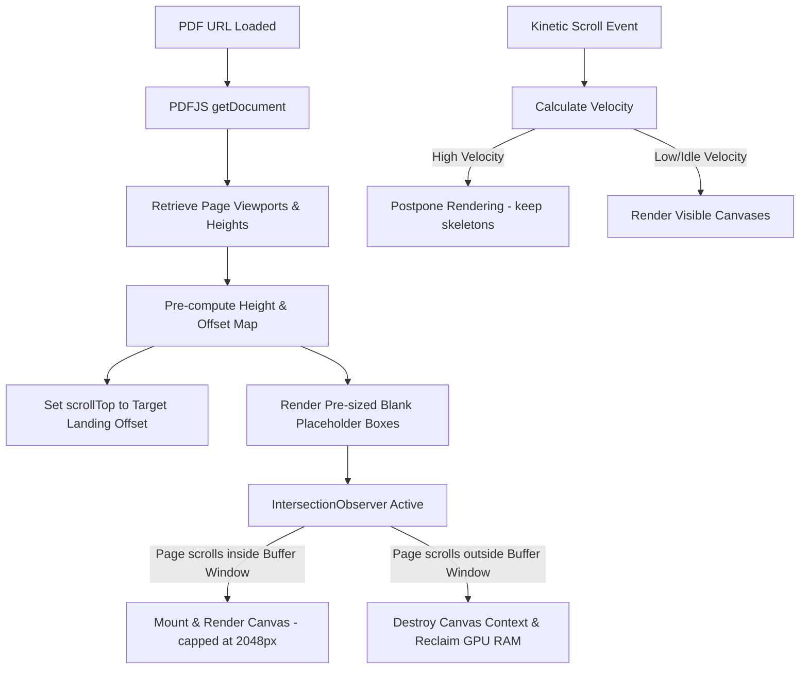

# High-Performance Continuous Scrolling PDF Viewer — Design Spec

## Goal Description

Overhaul the current single-page [PDFViewerPage.tsx](file:///e:/HIMANSHU/1ST_YEAR_Project/ClassHub-1/src/pages/app/PDFViewerPage.tsx) into a premium, continuous vertical-scrolling document viewer matching the standards of commercial web engines (Google Drive, Adobe Acrobat). 

The new system will deliver highly responsive reading flows, unified page-range highlighting, and absolute protection against browser-level GPU and memory crashes on low-end and high-end mobile devices alike.

---

## Technical Enhancements & Stress-Test Protections

To guarantee a stable 60 FPS scrolling experience on campus networks and student phones (including low-end mobile devices), the architecture incorporates four advanced optimizations:

### 1. The Meta-Layout Phase (Zero Layout-Shift)
On document load, the viewer performs a lightweight metadata pre-scan using PDF.js. It queries base dimensions (`page.getViewport({ scale: 1.0 })`) for all pages in `< 20ms` without rendering the heavy visual page contents. 
A comprehensive map of page heights and vertical `offsetTop` locations is pre-computed, allowing the browser to mount correctly sized placeholder skeletons immediately. This eliminates layout-shifting and scrollbar jumping.

### 2. Device-Adaptive Virtualization (Adaptive Option B)
We automatically detect device tiers on mount (`navigator.hardwareConcurrency` and RAM estimates) to select the optimal memory profile:
* **High-End Devices**: Viewport + 1 page above/below pre-rendered (Option B Window Buffer).
* **Low-End Devices**: Strict Viewport Rendering (Option A Viewport Buffer).

### 3. Strict Physical Canvas Ceilings (Pinch-Zoom Protection)
To prevent massive texture allocations at high zoom levels on Retina/DPI displays, the rendering pipeline caps the maximum physical width of any canvas to **2048px**. Scales beyond this ceiling are stretched via hardware-accelerated CSS transforms rather than generating new canvas bitmaps, capping maximum GPU memory to **16MB per page** at all times.

### 4. Scroll Velocity-Aware Debouncing (Kinetic Fling Protection)
If the scrolling speed exceeds a certain velocity threshold (kinetic finger fling), canvas draw tasks are temporarily queued. Canvases are only mounted and rendered when scrolling slows down or stops for more than **100ms**, preserving CPU/GPU cycles for layout fluidity during scrolling.

---

## Proposed Changes

### [PDF Viewer Component]

#### [MODIFY] [PDFViewerPage.tsx](file:///e:/HIMANSHU/1ST_YEAR_Project/ClassHub-1/src/pages/app/PDFViewerPage.tsx)
Completely refactor the PDF viewer component to support:
1. **Pre-layout scanning** and scrolling viewport mapping.
2. **IntersectionObserver-based Page Virtualizer Component (`PDFPageContainer`)** which cleanly mounts, renders, and unmounts canvas elements dynamically.
3. **Scroll listener** for speed tracking and debounced redraws.
4. **Pinch-to-zoom and zoom-control synchronization** that scales the global layout width, dynamically resizing placeholders to maintain relative scroll-percent alignment.
5. **Floating active-page overlay** that tracks active viewport intersections in real-time.
6. **Subtle visual highlight overlays** on pages falling within the assigned page range parameter.

---

## Detailed Data Flow

---

## Verification Plan

### Automated Tests
* **TypeScript Build**: Ensure `npm run build` compiles with no syntax errors.
* **ESLint Compliance**: Target `npx eslint` on `PDFViewerPage.tsx` to verify zero errors.

### Manual Verification
* **Initial Page Offset**: Load a PDF with a direct target `&page=5` to verify the page immediately mounts at scroll offset of page 5 without visual jumping.
* **Virtualization Check**: Scroll through a large multi-page PDF while monitoring active DOM elements. Confirm that canvas elements are only mounted for visible/buffer pages, and that offscreen page containers are represented strictly by blank placeholder `div` elements.
* **Zoom Stability**: Perform aggressive pinch-to-zoom gestures and tap zoom-in controls up to 3x, ensuring Safari/Chrome does not crash or reload the tab.
* **Active Page Pill**: Verify the floating indicator updates dynamically and accurately matches the page occupying the largest viewport area.
