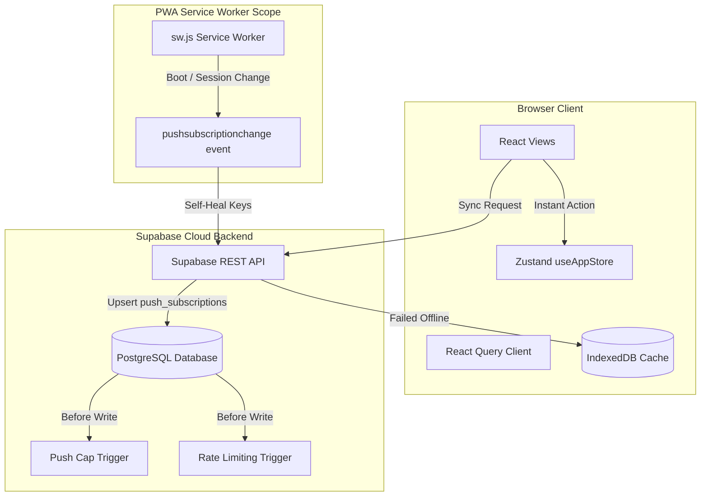

# PWA Push Sync & Cost-Control Robustness Specification

This specification details the architecture, design, and implementation parameters for Phase 1 PWA upgrades, focusing on **Self-Healing Push Subscriptions**, **Centralized Zustand Optimistic Caching**, and **Database-Level Cost-Control Triggers**.

---

## 1. Goal & Context
To transform ClassHub into a bulletproof, production-grade application, we are addressing silent PWA push delivery failures, head-of-line blocking queue vulnerabilities, offline state synchronization, and cost-abuse vector points on Supabase's free database tiers.

---

## 2. Technical Architecture & Components



---

## 3. Component Details & Specs

### A. Database Cost-Control & Rate Limiting Triggers

To prevent resource-abuse, fake device accumulation, and API spam, we write native Postgres triggers directly on the database.

#### 1. Push Subscription Device Capping
* **Target Table:** `public.push_subscriptions`
* **Limit:** Maximum 5 active device registrations per user.
* **Mechanism:** When a user registers their 6th device endpoint, the trigger automatically deletes their oldest endpoint record by `created_at` timestamp.
* **Implementation SQL:**
  ```sql
  CREATE OR REPLACE FUNCTION public.prune_stale_push_subscriptions()
  RETURNS TRIGGER AS $$
  BEGIN
    IF (SELECT count(*) FROM public.push_subscriptions WHERE user_id = NEW.user_id) >= 5 THEN
      DELETE FROM public.push_subscriptions
      WHERE id = (
        SELECT id FROM public.push_subscriptions
        WHERE user_id = NEW.user_id
        ORDER BY created_at ASC
        LIMIT 1
      );
    END IF;
    RETURN NEW;
  END;
  $$ LANGUAGE plpgsql SECURITY DEFINER;

  CREATE OR REPLACE TRIGGER before_insert_push_subscription
    BEFORE INSERT ON public.push_subscriptions
    FOR EACH ROW
    EXECUTE FUNCTION public.prune_stale_push_subscriptions();
  ```

#### 2. Writing Rate Limiter Trigger
* **Target Tables:** `public.announcements`, `public.polls`
* **Limit:** Maximum 5 creations per user (`auth.uid()`) per **1 minute**.
* **Mechanism:** Blocks fast-repeating loops or scraper tools, throwing a database exception with `SQLSTATE '42900'` on violation.
* **Implementation SQL:**
  ```sql
  CREATE OR REPLACE FUNCTION public.enforce_writing_rate_limit()
  RETURNS TRIGGER AS $$
  DECLARE
    recent_writes INT;
  BEGIN
    SELECT count(*) INTO recent_writes
    FROM public.announcements
    WHERE created_by = auth.uid()
      AND created_at > (NOW() - INTERVAL '1 minute');

    IF recent_writes >= 5 THEN
      RAISE EXCEPTION 'Rate limit exceeded. Maximum 5 posts per minute.'
        USING ERRCODE = '42900';
    END IF;
    RETURN NEW;
  END;
  $$ LANGUAGE plpgsql SECURITY DEFINER;
  ```

---

### B. Service Worker Self-Healing Push (`pushsubscriptionchange`)

* **Event Trigger:** Catch browser-driven subscription change events natively.
* **Storage Sync:** Fetch VAPID key details, query browser native `registration.pushManager`, load authentication token from IndexedDB using SW's `getDBSession()` helper, and call the Supabase REST API securely to upsert fresh endpoints.
* **Implementation JS (`src/sw.js`):**
  ```javascript
  self.addEventListener('pushsubscriptionchange', (e) => {
    e.waitUntil(
      getDBSession().then(async (session) => {
        if (!session || !session.token) {
          console.warn('[SW PushChange] No active session. Skipping self-heal.');
          return;
        }

        const VAPID_PUBLIC_KEY = import.meta.env.VITE_VAPID_PUBLIC_KEY;
        const supabaseUrl = import.meta.env.VITE_SUPABASE_URL;
        const supabaseAnonKey = import.meta.env.VITE_SUPABASE_ANON_KEY;

        const applicationServerKey = urlBase64ToUint8Array(VAPID_PUBLIC_KEY);
        const newSub = await self.registration.pushManager.subscribe({
          userVisibleOnly: true,
          applicationServerKey: applicationServerKey
        });

        const json = newSub.toJSON();

        await fetch(`${supabaseUrl}/rest/v1/push_subscriptions`, {
          method: 'POST',
          headers: {
            'apikey': supabaseAnonKey,
            'Authorization': `Bearer ${session.token}`,
            'Content-Type': 'application/json',
            'Prefer': 'resolution=merge-duplicates'
          },
          body: JSON.stringify({
            user_id: session.userId,
            endpoint: json.endpoint,
            p256dh: json.keys.p256dh,
            auth: json.keys.auth
          })
        });

        console.log('[SW PushChange] Subscription self-healing completed!');
      }).catch(err => {
        console.error('[SW PushChange] Subscription healing failed:', err);
      })
    );
  });
  ```

---

### C. Centralized Zustand Optimistic Caching Layer

We manage intermediate local state changes directly in the global Zustand store to guarantee immediate user feedback.

#### 1. Store Updates (`src/store/appStore.ts`)
* **State Additions:**
  - `optimisticAcks`: `Set<string>` (storing local session-based alert acknowledgments)
  - `optimisticVotes`: `Record<string, Set<string>>` (mapping poll IDs to sets of option IDs)
* **Action Additions:**
  - `addOptimisticAck(announcementId: string)`: Push alert ID to local memory set
  - `setOptimisticVote(pollId: string, optionIds: Set<string>)`: Set local poll choices
  - `clearOptimisticCache()`: Reset sets (invoked when query invalidation completes)

#### 2. Query Hook Interception (`src/hooks/useSupabaseQuery.ts`)
We refine custom hooks to read Zustand local sets and overlay them dynamically onto the remote lists before delivering to components:

* **`useAnnouncements` Refinement:**
  ```typescript
  const optimisticAcks = useAppStore(s => s.optimisticAcks);
  return data.map(ann => ({
    ...ann,
    isAcknowledged: ann.isAcknowledged || optimisticAcks.has(ann.id)
  }));
  ```
* **`usePolls` Refinement:**
  ```typescript
  const optimisticVotes = useAppStore(s => s.optimisticVotes);
  return data.map(poll => {
    const localVoteSet = optimisticVotes[poll.id];
    if (!localVoteSet) return poll;

    return {
      ...poll,
      userVotes: Array.from(localVoteSet).map(optId => ({ optionId: optId })),
      options: poll.options.map(opt => ({
        ...opt,
        votesCount: localVoteSet.has(opt.id) ? opt.votesCount + 1 : opt.votesCount
      }))
    };
  });
  ```

---

## 4. Verification Plan

### Automated Database Verification
* Push database migration locally using `supabase migration new db_rate_limiter_triggers` and `supabase db reset`.
* Run automated integration scripts attempting to register more than 5 subscriptions, validating old ones prune.
* Run script attempting to write 6 announcements in less than 60 seconds, checking for rejection errors.

### Manual PWA Verification
* Toggle network connection to "Offline" inside Chrome DevTools.
* Tap "Got It" on a Flash Post card, validating the UI removes it in 0ms.
* Check IndexedDB to confirm the mutation enqueued in `offline-actions`.
* Reconnect online, validating background synchronization flushes queue and query resets cleanly.
* Trigger a push key rotation event inside browser tools to check if `pushsubscriptionchange` updates keys.
