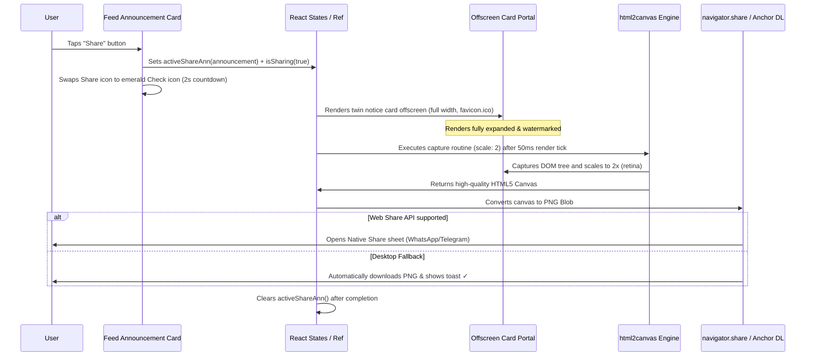

# Design Specification: Announcement Card Share Engine (Dynamic PNG capture)

This document specifies the technical design, visual aesthetics, performance safeguards, and capture pipelines for generating and sharing crystal-clear notice card images directly from ClassHub to social media channels (like WhatsApp, Telegram, or Slack).

---

## 1. Product Requirements & Scope

*   **Secure Portable Sharing:** Enables sharing announcements across academic sections and to C-end users without exposing secure, section-scoped database routes (retaining strict Row-Level Security isolation).
*   **Approach B (Offscreen Capture Portal):** Captures cards inside an offscreen portal, ensuring that notices are:
    1.  *Always Fully Expanded* (not truncated by "Read More" clamp lines).
    2.  *Completely Clutter-Free* (omits dynamic interactive buttons like reactions, Q&A comment boxes, and acknowledgment states).
    3.  *Professional Brand Presentation* (embedded official ClassHub name + logo watermark).
*   **Web Share API Integration:** Utilizes `navigator.share` to push raw PNG files directly to native WhatsApp/Telegram share sheets on supported mobile devices/PWAs.
*   **Direct Download Fallback:** Gracefully triggers a direct PNG file download on desktop environments or unsupported browsers, accompanied by clear visual toasts.
*   **Visual Icon Feedback (Micro-Animation):** Temporarily transforms the Share button icon into an emerald checkmark for 2 seconds upon click to provide robust, satisfying confirmation.

---

## 2. Visual Style & Offscreen Card Branding

To conform to the **UI/UX Pro Max** guidelines, the shared card is optimized specifically to look premium when received on messaging apps:

*   **Element Location:** Rendered inside a hidden offscreen container (`position: 'absolute', top: '-9999px', left: '-9999px', width: '600px'`) to establish a static, desktop-density rendering viewport.
*   **Priority Gutter Border:** Encapsulated in a thick, category-coded boundary border (`border: 2px solid var(--category-color)`) preserving high-contrast outline accents.
*   **Header Watermark:**
    *   **Official Logo:** Renders the official `/favicon.ico` brand asset at `32x32px` dimensions.
    *   **ClassHub Text:** Display typography (`font-weight: 800`, `font-size: 16px`, `letter-spacing: 0.05em`) in high-contrast `var(--text-primary)`.
    *   **Monospaced Section Tag:** Aligned on the right-hand corner displaying the section context: `"BETA SECTION P-2 | SKIT"`.
*   **Content Typography:**
    *   Title: Bold display headings (`font-size: 20px`, `font-weight: 700`, `line-height: 1.3`).
    *   Body: Full un-truncated text at `font-size: 14.5px` and `line-height: 1.625` for optimal readability.
    *   Attachments: Displays an elegant grid list of attached files with file-type symbols (e.g. PDF file icon) but hides interactive download/trash triggers.

---

## 3. Technical Architecture & Data Flow



---

## 4. Implementation Details

### A. Share Button in Card Footer
Add the `Share` trigger button to the action footer of each announcement card in both `AnnouncementsPage.tsx` and the dashboard detailed bottom sheets:
```typescript
interface CardShareState {
  isSharing: boolean;
  success: boolean;
}
```

### B. Offscreen Portal Component
Mounted at the bottom of the main layout, rendering dynamically only when an announcement is active for sharing:
```typescript
function OffscreenSharePortal({ 
  announcement, 
  domRef 
}: { 
  announcement: Announcement; 
  domRef: React.RefObject<HTMLDivElement>;
}) {
  return (
    <div
      ref={domRef}
      style={{
        position: 'absolute',
        top: '-9999px',
        left: '-9999px',
        width: '600px',
        padding: '24px',
        background: 'var(--bg-elevated)',
        border: `2px solid ${getPriorityColor(announcement.priority)}`,
        borderRadius: 'var(--radius-lg)',
        color: 'var(--text-primary)',
        fontFamily: 'var(--font-body)',
        display: 'flex',
        flexDirection: 'column',
        gap: '16px',
        boxSizing: 'border-box',
      }}
    >
      {/* 1. BRAND HEADER WATERMARK */}
      <div style={{ display: 'flex', alignItems: 'center', justifyContent: 'space-between', borderBottom: '1px solid var(--border-default)', paddingBottom: '12px' }}>
        <div style={{ display: 'flex', alignItems: 'center', gap: '8px' }}>
          
          <span style={{ fontWeight: 800, fontSize: '16px', letterSpacing: '0.05em' }}>ClassHub</span>
        </div>
        <span style={{ fontFamily: 'var(--font-mono)', fontSize: '11px', color: 'var(--text-secondary)' }}>
          BETA SECTION P-2 | SKIT
        </span>
      </div>

      {/* 2. TITLE & TIMESTAMP */}
      <div>
        <h1 style={{ fontSize: '20px', fontWeight: 700, margin: '0 0 6px 0', lineHeight: 1.3 }}>
          {announcement.title}
        </h1>
        <span style={{ fontFamily: 'var(--font-mono)', fontSize: '11px', color: 'var(--text-muted)' }}>
          {timeAgo(announcement.createdAt)}
        </span>
      </div>

      {/* 3. FULL DESCRIPTION */}
      <p style={{ fontSize: '14.5px', lineHeight: 1.625, color: 'var(--text-primary)', margin: 0, whiteSpace: 'pre-wrap', wordBreak: 'break-word' }}>
        {announcement.message}
      </p>

      {/* 4. ATTACHMENT LABELS (If present) */}
      {announcement.attachments && announcement.attachments.length > 0 && (
        <div style={{ borderTop: '1px solid var(--border-default)', paddingTop: '12px', display: 'flex', flexDirection: 'column', gap: '8px' }}>
          <span style={{ fontSize: '11px', fontWeight: 600, color: 'var(--text-secondary)' }}>
            📎 ATTACHMENTS ({announcement.attachments.length})
          </span>
          <div style={{ display: 'flex', flexWrap: 'wrap', gap: '8px' }}>
            {announcement.attachments.map(att => (
              <div key={att.id} style={{ display: 'flex', alignItems: 'center', gap: '6px', background: 'rgba(255,255,255,0.03)', border: '1px solid var(--border-default)', borderRadius: 'var(--radius-sm)', padding: '6px 10px', fontSize: '12px' }}>
                <span>{att.filename}</span>
              </div>
            ))}
          </div>
        </div>
      )}
    </div>
  );
}
```

---

## 5. Verification Plan

### A. Automated Integration Tests
*   Verify that `html2canvas` is resolved properly inside imports without throwing module resolution errors.
*   Ensure that PWA packaging and TypeScript compiles successfully under production bundling guidelines (`npm run build`).
*   Ensure linter compiles with zero warning flags (`npm run lint`).

### B. Manual Verification Checks
*   **Micro-Animation Confirmation:** Click "Share" on an announcement card. Verify that the Share icon immediately converts to an emerald green checkmark and returns to default after 2 seconds.
*   **Offscreen Transparency:** Ensure that no visible UI jumps, reflow shifts, or flashing occurrences occur on the active screen during card image creation.
*   **Attachment Render Check:** Confirm that announcements with files accurately output attachment indicators in the captured PNG file.
*   **Android/PWA Web Share Check:** Test on an active mobile device/PWA environment. Confirm that clicking Share opens the native system share drawer.
*   **Desktop Download Check:** Test on desktop Chrome. Confirm that clicking Share triggers a direct PNG image download (`Title_Notice.png`) and pops up the success notification toast.
