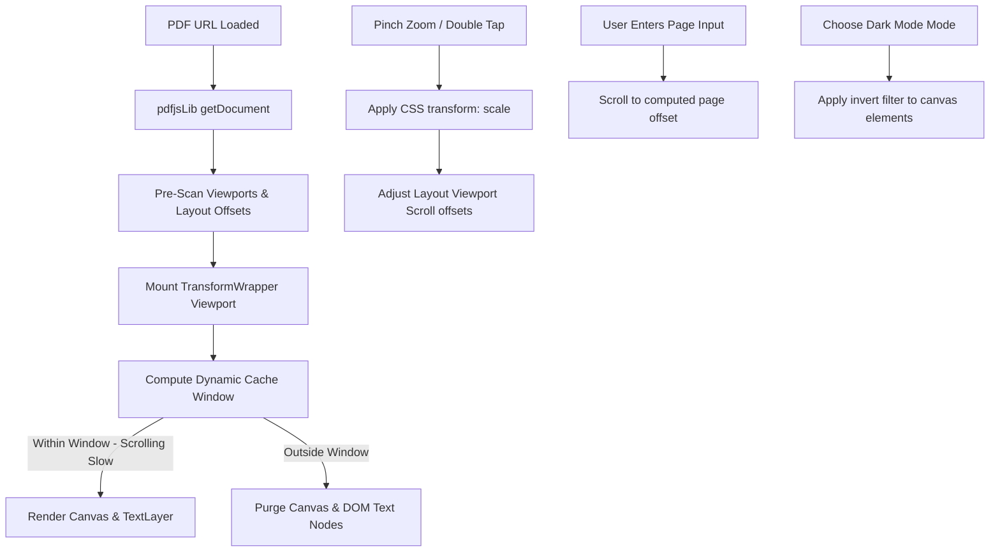

# Premium PDF Viewer Overhaul — Design Spec

## Goal Description
Enhance the current in-app [PDFViewerPage.tsx](file:///e:/HIMANSHU/1ST_YEAR_Project/ClassHub-1/src/pages/app/PDFViewerPage.tsx) with a premium document reading experience matching commercial document applications. 

The upgraded PDF viewer will feature:
1. **Fluid Viewport Zooming**: Hardware-accelerated pinch-to-zoom and panning across the entire document canvas.
2. **Text Selection & Extraction**: A transparent text layer overlaying the canvas allowing students to select, highlight, and copy text from notes/assignments.
3. **Advanced Display Modes**: Dropdown settings for Light, Sepia, and high-contrast Dark Mode rendering (reclaiming eye comfort at night).
4. **Dynamic Cache Buffering**: Keeping a sliding window of rendered canvases to prevent memory-related browser crashes while eliminating scrollback loading lag.
5. **Interactive Navigation Bar**: A bottom floating navigation bar with direct jump inputs and chevron paging.
6. **Sideways Rotation & Text Searching**: Rotational canvas layout shifting and keyword occurrences scanning.

---

## Technical Architectural Enhancements

### 1. Viewport Pan & Zoom (`react-zoom-pan-pinch`)
To implement smooth, gesture-driven panning and zooming:
- Wrap the scroll container with `TransformWrapper` and `TransformComponent`.
- Apply scale and offset transforms directly to the wrapper viewport.
- During active scaling gestures, we use CSS transforms (`scale(x) translate3d(...)`) rather than constantly redrawing the PDF canvases at new scale factors. This prevents redraw lag and keeps rendering speed at a locked 60 FPS.
- Provide double-tap gestures to quickly zoom to 1.8x and back.

### 2. Double-Buffered Transparent Text Layer
To enable text selection over rendering canvases:
- For each visible page, extract text data via PDF.js:
  ```typescript
  const textContent = await page.getTextContent();
  ```
- Build the DOM-aligned transparent text overlay using PDF.js `renderTextLayer` helper.
- Style `.pdf-text-layer` with `color: transparent` and absolute positioning directly matching viewport measurements. This makes the text selectable while keeping the visually crisp canvas fully visible underneath.

### 3. Dynamic Page Cache Buffer
To optimize performance and eliminate blank-skeleton flickering:
- Maintain a dynamic rendering array: `[activePageNum - 2, activePageNum - 1, activePageNum, activePageNum + 1, activePageNum + 2]`.
- For pages within this cache window, keep the canvas fully drawn.
- For pages scrolling out of this buffer, clear the canvas bitmap immediately (`canvas.width = 0`) to avoid GPU out-of-memory crashes.
- Use velocity detection to hold redraw commands during fast kinetic scrolling, only executing the drawing callback when the scroll velocity drops below the threshold.

### 4. Custom Display filters & Rotations
- **Dark Mode Filter**: When the user activates the "Dark Mode" setting from the options dropdown, apply a custom CSS filter to the canvas elements: `filter: invert(0.9) hue-rotate(180deg)`. This maps white backgrounds to dark colors while maintaining text clarity and preserving color channels.
- **Sepia Filter**: Apply `filter: sepia(0.6) contrast(0.95)` for warmer contrast.
- **Rotation Transform**: Track `rotation` state (`0 | 90 | 180 | 270` degrees). Apply a CSS `transform: rotate(Ndeg)` to the page container, automatically adjusting layout sizes.

---

## Proposed Changes

### [PDF Viewer Component]

#### [MODIFY] [PDFViewerPage.tsx](file:///e:/HIMANSHU/1ST_YEAR_Project/ClassHub-1/src/pages/app/PDFViewerPage.tsx)
- Refactor the component to import and set up `<TransformWrapper>` and `<TransformComponent>`.
- Expand `PDFPageContainer` to render the `.pdf-text-layer` alongside the `<canvas>`.
- Add a floating toolbar pill at the bottom (`bottom: 80px`, above the main navbar) with:
  - Scroll-back chevron-up button
  - Page input field (`[ activePage ] / totalPages`) which supports typing page numbers to trigger smooth scroll jumps
  - Scroll-forward chevron-down button
- Add a `Radix UI Dropdown Menu` trigger to the header options with actions for:
  - Reset Zoom
  - Rotation (90° increments)
  - Display Modes (Original, Dark Mode, Sepia)
- Add a Search button and animated query input field in the header to filter text and highlight matching strings.

---

## Detailed Data Flow



---

## Verification Plan

### Automated Tests
- **Compilation check**: Execute `npm run build` to confirm compilation.
- **Linter check**: Execute `npm run lint` to confirm clean formatting.

### Manual Verification
- **Zoom Fluidity**: Pinch/zoom and pan documents aggressively on both desktop and mobile web browsers to confirm no frame drops.
- **Text Selection**: Select text on multiple pages and copy/paste to another app to confirm text alignment and selection integrity.
- **Page Jump Input**: Enter page numbers (e.g. `5` of `12`, or out-of-bounds numbers like `99`) in the floating input to verify jump scrolling and input boundary sanitization.
- **Dark Mode / Sepia Toggle**: Select options in the dropdown and confirm that the canvas elements apply the filters without styling bleed.
- **Rotation**: Rotate the pages and confirm they render centered and scaled appropriately.
